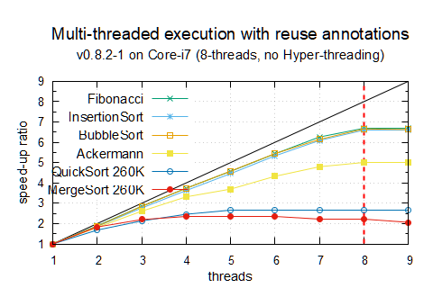
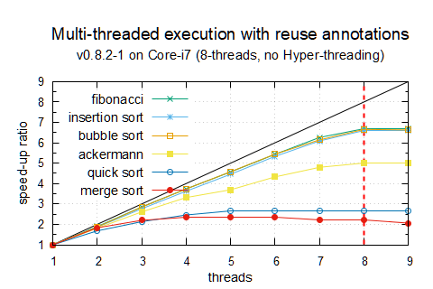
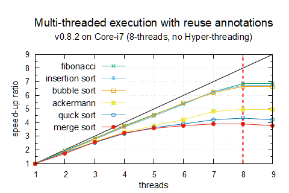
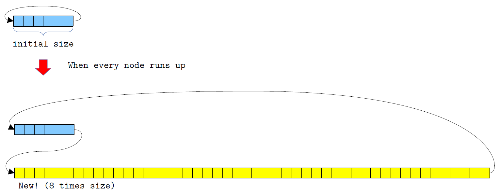

# Change log
### v0.8.3-1 minor update (released on 21 July 2022)
#### Polished
* **Built-in agent** `Dup`: it can duplicate attributes also immediately. For instance, with respect to `Cons(int, xs)`, it performs as follows:
  ```
  Dup(a1,a2) >< (int i):xs => a1~i:w1, a2~i:w2, Dup(w1,w2)~xs;
  ```


### v0.8.3 (released on 19 July 2022)
#### New Features

* **Built-in agent** `Dup`: it duplicates any nets gradually with the following rules:

  ```
  >>> Dup(a1,a2) ~ [1,2,3];
  (7 interactions, 0.00 sec)
  >>> ifce;
  a1 a2
  
  Connections:
  a1 ->[1,2,3]
  a2 ->[1,2,3]
  
  >>>
  ```

### v0.8.2-2 minor update (released on 30 May 2022)

|              |                  Haskell                   |                  OCaml                  |                   SML                   |                   Python                   |                      Inpla8                      |                        Inpla8r                         |
| ------------ | :----------------------------------------: | :-------------------------------------: | :-------------------------------------: | :----------------------------------------: | :----------------------------------------------: | :----------------------------------------------------: |
| ack(3,11)    |   [2.30](comparison/Haskell/ack3-11.hs)    |   [0.46](comparison/OCaml/ack3_11.ml)   | [**0.43**](comparison/SML/ack3-11.sml)  |     [-](comparison/Python/ack3-11.py)      | [0.86](comparison/Inpla/src/ack-stream_3-11.in)  | [0.71](comparison/Inpla/src/ack-stream_3-11-reuse.in)  |
| fib 38       |    [1.60](comparison/Haskell/fib38.hs)     |  [**0.15**](comparison/OCaml/fib38.ml)  |    [0.27](comparison/SML/fib38.sml)     |     [8.88](comparison/Python/fib38.py)     |      [0.40](comparison/Inpla/src/fib-38.in)      |      [0.43](comparison/Inpla/src/fib-38-reuse.in)      |
| bsort 20000  | [4.98](comparison/Haskell/bsort-40000.hs)  | [6.78](comparison/OCaml/bsort40000.ml)  | [2.38](comparison/SML/bsort-40000.sml)  | [19.91](comparison/Python/bsort-40000.py)  |   [2.16](comparison/Inpla/src/bsort-40000.in)    | [**1.58**](comparison/Inpla/src/bsort-40000-reuse.in)  |
| isort 20000  | [2.15](comparison/Haskell/isort-40000.hs)  | [1.52](comparison/OCaml/isort40000.ml)  | [0.60](comparison/SML/isort-40000.sml)  |  [9.58](comparison/Python/isort-40000.py)  | [**0.29**](comparison/Inpla/src/isort-40000.in)  |   [0.33](comparison/Inpla/src/isort-40000-reuse.in)    |
| qsort 260000 | [0.34](comparison/Haskell/qsort-800000.hs) | [0.25](comparison/OCaml/qsort800000.ml) | [0.27](comparison/SML/qsort-800000.sml) | [10.40](comparison/Python/qsort-800000.py) |   [0.15](comparison/Inpla/src/qsort-800000.in)   | [**0.11**](comparison/Inpla/src/qsort-800000-reuse.in) |
| msort 260000 | [0.39](comparison/Haskell/msort-800000.hs) | [0.29](comparison/OCaml/msort800000.ml) | [0.26](comparison/SML/msort-800000.sml) | [10.96](comparison/Python/msort-800000.py) | [**0.15**](comparison/Inpla/src/msort-800000.in) | [**0.15**](comparison/Inpla/src/msort-800000-reuse.in) |

#### Bug fix

* **`and` and `or` operations**: These operations had not work well due to bad effects of bytecode optimisations, and these has been fixed.

#### Changes
* **The benchmark table**: Bubble sort in Inpla has been changed to be done in the same method to others, and still Inpla keeps the fastest. 


### v0.8.2-1 minor update (released on 2 May 2022)

|              |                  Haskell                   |                  OCaml                  |                   SML                   |                   Python                   |                      Inpla8                      |                        Inpla8r                         |
| ------------ | :----------------------------------------: | :-------------------------------------: | :-------------------------------------: | :----------------------------------------: | :----------------------------------------------: | :----------------------------------------------------: |
| ack(3,11)    |   [2.30](comparison/Haskell/ack3-11.hs)    |   [0.46](comparison/OCaml/ack3_11.ml)   | [**0.43**](comparison/SML/ack3-11.sml)  |     [-](comparison/Python/ack3-11.py)      | [0.84](comparison/Inpla/src/ack-stream_3-11.in)  | [0.71](comparison/Inpla/src/ack-stream_3-11-reuse.in)  |
| fib 38       |    [1.60](comparison/Haskell/fib38.hs)     |  [**0.15**](comparison/OCaml/fib38.ml)  |    [0.27](comparison/SML/fib38.sml)     |     [8.88](comparison/Python/fib38.py)     |      [0.41](comparison/Inpla/src/fib-38.in)      |      [0.43](comparison/Inpla/src/fib-38-reuse.in)      |
| bsort 40000  | [34.48](comparison/Haskell/bsort-40000.hs) | [34.62](comparison/OCaml/bsort40000.ml) | [12.06](comparison/SML/bsort-40000.sml) | [79.53](comparison/Python/bsort-40000.py)  |   [3.02](comparison/Inpla/src/bsort-40000.in)    | [**2.52**](comparison/Inpla/src/bsort-40000-reuse.in)  |
| isort 40000  | [12.54](comparison/Haskell/isort-40000.hs) | [7.45](comparison/OCaml/isort40000.ml)  | [2.94](comparison/SML/isort-40000.sml)  | [36.89](comparison/Python/isort-40000.py)  | [**1.15**](comparison/Inpla/src/isort-40000.in)  |   [1.24](comparison/Inpla/src/isort-40000-reuse.in)    |
| qsort 260000 | [0.34](comparison/Haskell/qsort-800000.hs) | [0.25](comparison/OCaml/qsort800000.ml) | [0.27](comparison/SML/qsort-800000.sml) | [10.40](comparison/Python/qsort-800000.py) |   [0.15](comparison/Inpla/src/qsort-800000.in)   | [**0.12**](comparison/Inpla/src/qsort-800000-reuse.in) |
| msort 260000 | [0.39](comparison/Haskell/msort-800000.hs) | [0.29](comparison/OCaml/msort800000.ml) | [0.26](comparison/SML/msort-800000.sml) | [10.96](comparison/Python/msort-800000.py) | [**0.15**](comparison/Inpla/src/msort-800000.in) | [**0.15**](comparison/Inpla/src/msort-800000-reuse.in) |

#### Bug fix

* **Output format of integers** (again): Only these outputs had been fixed on v0.8.1-2, so these calculation and management had been 32-bit format. Now re-fixed as 64-bit format.

#### Changes

* In the benchmark table from this version Quick and Merge sorts are for smaller lists whose elements are 260000, while it was 400000. This is because OCaml raises stack overflow error for over 260000 elements. As shown the following graph, the speed-up ratio has changed not so good, while these sort works for 800000 elements have good performance. So, it seems that 260K elements are too small for Inpla to perform in parallel.

  



### v0.8.2 (released on 28 April 2022)



|              |                  Haskell                   |                  OCaml                  |                   SML                   |                   Python                    |                     Inpla8                      |                        Inpla8r                         |
| ------------ | :----------------------------------------: | :-------------------------------------: | :-------------------------------------: | :-----------------------------------------: | :---------------------------------------------: | :----------------------------------------------------: |
| ack(3,11)    |   [2.30](comparison/Haskell/ack3-11.hs)    |   [0.46](comparison/OCaml/ack3_11.ml)   | [**0.43**](comparison/SML/ack3-11.sml)  |      [-](comparison/Python/ack3-11.py)      | [0.83](comparison/Inpla/src/ack-stream_3-11.in) | [0.71](comparison/Inpla/src/ack-stream_3-11-reuse.in)  |
| fib 38       |    [1.60](comparison/Haskell/fib38.hs)     |  [**0.15**](comparison/OCaml/fib38.ml)  |    [0.27](comparison/SML/fib38.sml)     |     [8.88](comparison/Python/fib38.py)      |     [0.39](comparison/Inpla/src/fib-38.in)      |      [0.40](comparison/Inpla/src/fib-38-reuse.in)      |
| bsort 40000  | [34.48](comparison/Haskell/bsort-40000.hs) | [34.62](comparison/OCaml/bsort40000.ml) | [12.06](comparison/SML/bsort-40000.sml) |  [79.53](comparison/Python/bsort-40000.py)  | [**2.98**](comparison/Inpla/src/bsort-40000.in) |   [2.48](comparison/Inpla/src/bsort-40000-reuse.in)    |
| isort 40000  | [12.54](comparison/Haskell/isort-40000.hs) | [7.45](comparison/OCaml/isort40000.ml)  | [2.94](comparison/SML/isort-40000.sml)  |  [36.89](comparison/Python/isort-40000.py)  | [**1.15**](comparison/Inpla/src/isort-40000.in) |   [1.21](comparison/Inpla/src/isort-40000-reuse.in)    |
| qsort 800000 | [1.56](comparison/Haskell/qsort-800000.hs) |  [-](comparison/OCaml/qsort800000.ml)   | [1.14](comparison/SML/qsort-800000.sml) | [97.37](comparison/Python/qsort-800000.py)  |  [0.66](comparison/Inpla/src/qsort-800000.in)   | [**0.37**](comparison/Inpla/src/qsort-800000-reuse.in) |
| msort 800000 | [1.55](comparison/Haskell/msort-800000.hs) |  [-](comparison/OCaml/msort800000.ml)   | [1.04](comparison/SML/msort-800000.sml) | [100.04](comparison/Python/msort-800000.py) |  [0.48](comparison/Inpla/src/msort-800000.in)   | [**0.35**](comparison/Inpla/src/msort-800000-reuse.in) |

#### New Features

* **A built-in agent** `Eraser`: it disposes any nets gradually with the following rules:


#### Bug fix
* **The benchmark table was wrong**: With respect to the results in Haskell, the execution times of sort works were too short. This is thanks to its lazy evaluation strategy, quite nice, that gets only the first 10 elements the same as the written program, though these are expected to be taken after finishing these sort works. So, every sort work will be followed by a validation check if a given list is correctly sorted, not only in Haskell but also in others.


### v0.8.1-2 minor update (released on 16 April 2022)

#### Bug fix
* **Output format of integers**: Integer numbers had been outputted with 32-bit format, though it is manages as 61bit FIXINT. Now these are looked as long integers.


#### Polished

* **The benchmark table**: Several OCaml execution times have been added to the benchmark table. These programs are stored in `comparison/OCaml`.


### v0.8.1-1 minor update (released on 10 March 2022)

#### Polished

* **Sample file (Tower of Hanoi)**: A new sample file for Tower of Hanoi is included in `sample` directory.

* **The abbreviation**: it can take an empty arguments list on its left-hand side like:

  ```
  << Agent(paramlist,param)    // this is an abbreviation for Agent(paramlist)~param
  ```

  This could be handy for elimination operation:

  ```
  Eps >< Z =>;
  Eps >< S(x) => Eps~x;
  
  // Nets
  Eps ~ S(Z);
  
  // Abbreviated notation of the nets
  << Eps(S(Z));
  ```

* **Makefile**: The configuration file `src/config.h` is also included as update files in `Makefile`. So, `make` command works when the configuration file is changed.

* **Rule table**: A simple implementation with arrays is prepared. It could be expected to work better, but it seems not so differences. It becomes available by making the following definition un-comment in `src/config.h`:

  ```
  // ------------------------------------------------
  // RuleTable
  // ------------------------------------------------
  // There are two implementation for the rule table:
  //   * Hashed linear table (default)
  //   * Simple array table
  // To use the hashed one, comment out the following RULETABLE_SIMPLE definition.
  
  //#define RULETABLE_SIMPLE
  ```

  

  


### v0.8.1 (released on 3 March 2022)

|              | Haskell  |   SML    | Python | Inpla1 | Inpla1_r | Inpla7 | Inpla7_r |
| ------------ | :------: | :------: | :----: | :----: | :------: | :----: | :------: |
| ack(3,11)    |   2.31   | **0.41** |   -    |  4.32  |   3.49   |  0.86  |   0.73   |
| fib 38       |   1.60   | **0.26** |  8.49  |  2.29  |   2.80   |  0.43  |   0.45   |
| bsort 40000  |  34.81   |  11.17   | 76.72  | 18.01  |  16.42   |  2.79  | **2.61** |
| isort 40000  | **0.02** |   2.97   | 36.63  |  6.98  |   8.08   |  1.22  |   1.30   |
| qsort 800000 | **0.15** |   1.16   | 97.30  |  6.09  |   1.79   |  0.63  |   0.37   |
| msort 800000 |   0.46   |   1.00   | 98.27  |  3.93  |   1.35   |  0.46  | **0.35** |

#### New Features:
* **Introduced a configuration file**: A configuration file `src/config.h` is introduced such as for optimisation and heap data structures. Change it as your programs can be executed faster.

* **Two address codes**: Virtual machines and the compiler support two-address codes. It seems that these could work efficiently but not so significant, a little fluctuated, so I am not sure that it is strongly recommendable. Actually I stopped applying this method for arithmetic operations and other MKAGENT operations. A section is prepared in the configuration file `src/config.h`, so select your appropriate level by making these comments out.

  ```
  // Generate virtual machine codes with two-address notation
  #define OPTIMISE_TWO_ADDRESS
  
  #ifdef OPTIMISE_TWO_ADDRESS
  #define OPTIMISE_TWO_ADDRESS_MKAGENT1 // For MKAGENT1
  #define OPTIMISE_TWO_ADDRESS_MKAGENT2 // For MKAGENT2
  #define OPTIMISE_TWO_ADDRESS_MKAGENT3 // For MKAGENT3
  //#define OPTIMISE_TWO_ADDRESS_UNARY // For Unary operator like INC, DEC
  #endif  
  ```

#### Polished:

* **Retrieved the old version of expandable ring buffers**: The old version of the expandable ring buffer has been retrieved. One heap structure could work well for some problems, but it might not so well for others. Choose an appropriate heap structure by making the following comments out in the configuration file `src/config.h`:

  ```
  /* Heaps ------------------------------------------ 
     Choose one among the following three definitions:
     -------------------------------------------------- */
  #define FLEX_EXPANDABLE_HEAP     // Inserted heaps size can be flexible.
  //#define EXPANDABLE_HEAP        // Expandable heaps for agents and names
  //#define FIXED_HEAP             // The heap size is fixed. (Default)
  ```

  

  


### v0.8.0 (released on 27 February 2022)

|              | Haskell  |   SML    | Python | Inpla1 | Inpla1_r | Inpla7 | Inpla7_r |
| ------------ | :------: | :------: | :----: | :----: | :------: | :----: | :------: |
| ack(3,11)    |   2.31   | **0.41** |   -    |  4.42  |   3.53   |  0.88  |   0.75   |
| fib 38       |   1.60   | **0.26** |  8.49  |  2.30  |   2.83   |  0.42  |   0.46   |
| bsort 40000  |  34.81   |  11.17   | 76.72  | 17.64  |  16.92   |  2.75  | **2.70** |
| isort 40000  | **0.02** |   2.97   | 36.63  |  6.72  |   8.34   |  1.20  |   1.34   |
| qsort 800000 | **0.15** |   1.16   | 97.30  |  6.07  |   1.81   |  0.64  |   0.37   |
| msort 800000 |   0.46   |   1.00   | 98.27  |  3.92  |   1.36   |  0.46  | **0.35** |

#### New Features:

* **Flexibly expandable ring buffer for agents and names**: We can change the size of buffers that are inserted when all of nodes run up, though it was fixed before. It is possible to start a small heap for small computation, and it can be expanded for larger computation.

  

  * To set the initial size to 2^*n*, use the execution option `-Xms n` (default `n` is 12, so the size is 4096):
  * To set the multiple increment to 2^*n*, use the option `-Xmt n` (default `n` is 3, so the inserted heap is 8 times of the run up heap)

  To use the fixed sized ring buffer, comment out the following definition in `src/inpla.y`:

  ```
  #define EXPANDABLE_HEAP    // Expandable heaps for agents and names
  ```


### v0.7.3 (released on 20 February 2022)

|              | Haskell  |   SML    | Python | Inpla1 | Inpla1_r | Inpla7 | Inpla7_r |
| ------------ | :------: | :------: | :----: | :----: | :------: | :----: | :------: |
| ack(3,11)    |   2.31   | **0.41** |   -    |  4.75  |   3.47   |  1.49  |   0.73   |
| fib 38       |   1.60   | **0.26** |  8.49  |  2.39  |   2.89   |  0.48  |   0.51   |
| bsort 40000  |  34.81   |  11.17   | 76.72  | 15.56  |  17.16   |  3.99  | **2.81** |
| isort 40000  | **0.02** |   2.97   | 36.63  |  7.66  |   8.38   |  2.01  |   1.38   |
| qsort 800000 | **0.15** |   1.16   | 97.30  |  2.32  |   1.82   |  0.56  |   0.36   |
| msort 800000 |   0.46   |   1.00   | 98.27  |  1.23  |   1.37   |  0.42  | **0.33** |

#### Polished:

* **Bytecode optimisation inspired by Tail Recursive Optimisation**:  As a result, this optimisation brings about faster computation up to about twice in comparison with no reuse-annotated computation.

  * When an interaction rule has a connection whose both sides agents have the same IDs to the active pair, computation of the connection can be realised by applying the same bytecode sequence of the rule to the connection after replacing ports of the active pair into agents ports of the connection. Moreover, when the connection is placed at the tail of a connection sequence, we can restart the same bytecode sequence after replacing these ports. For instance, take the following rule for Fibonacci number:

    ```
    fib(ret) >< (int n)
    | n == 0 => ret~0
    | n == 1 => ret~1
    | _ => Add(ret, cnt2)~cnt1, fib(cnt1)~(n-1), fib(cnt2)~(n-2);
    ```
    This rule has a connection `fib(cnt2)~(n-2)` at the tail of the third connection sequence. The connection is computable by using the same bytecode sequence of `fib(ret)><(int n)` with replacing these ports `ret`,  `n` into `cnt2`, `n-2`, respectively. So, the computation of the third connection sequence is realised by bytecode sequences of the other connections and the port replacing, and a loop operation to start execution from the top of the rule sequence.

  * This is also possible not only for agents like `(int n)`, but also other constructor agents such as `Cons(x,xs)`, `S(x)`. The following is a part of rules for insertion sort:

    ```
    isort(ret) >< x:xs => insert(ret, x)~cnt, isort(cnt)~xs;
    ```
    When the `xs` connects to an `Cons(y,ys)` agent, then the computation is also realised by the loop operation because the `isort(cnt)~xs` can be regarded as `isort(cnt)~y:ys`, whose agents have the same IDs of the active pair. So, by introducing a conditional branch whether the `xs` connects to a `Cons` agent or not, this rule computation is also realised by the loop operation.
  
  * In this version, this optimisation will be triggered when such the connection is placed at the tail of a sequence of connections.


### v0.7.2-1 (released on 12 February 2022)

#### Bug Fix:
* **Bytecode generation**: A bytecode sequence for `EQI src fixint dest` was generated as `EQI src int dest`, so it was fixed.
* **Bytecode optimisation**:  Blocks for scopes of Copy Propagation optimisation were not specified for each guard expression. It was fixed and works well.


### v0.7.2 (released on 9 February 2022)

#### Polished:
* **Bytecodes for global names**: To obtain a global name whose name is `sym` on a `dest` register, the following bytecode is executed: `MKGNAME dest sym` where the type of `sym` is `char*`.  Every symbol for agents and global names is assigned to the unique ID number managed by `IdTable`, so by introducing the ID number `id` for the `sym`, the bytecode is changed into `MKGNAME id dest`.
* **Separation of source codes of NameTable**: The `NameTable` is used to lookup ID numbers for symbol chars in compilation and interpreter execution. By changing the bytecode of `MKGNAME`, there becomes no need to be used in virtual machine execution directly, so the source codes for the `NameTable` is separated from `src/inpla.y`. This contributes quite a little speed-up at most 1%.


### v0.7.1 (released on 4 February 2022)
|              | Haskell  |   SML    | Python | Inpla1 | Inpla1_r | Inpla7 | Inpla7_r |
| ------------ | :------: | :------: | :----: | :----: | :------: | :----: | :------: |
| ack(3,11)    |   2.31   | **0.41** |   -    |  4.78  |   3.55   |  1.51  |   0.74   |
| fib 38       |   1.60   | **0.26** |  8.49  |  3.10  |   2.95   |  0.60  |   0.50   |
| bsort 40000  |  34.81   |  11.17   | 76.72  | 24.85  |  18.22   |  7.39  | **2.92** |
| isort 40000  | **0.02** |   2.97   | 36.63  | 11.85  |   8.71   |  3.65  |   1.41   |
| qsort 800000 | **0.15** |   1.16   | 97.30  |  3.54  |   1.88   |  0.83  |   0.34   |
| msort 800000 |   0.46   |   1.00   | 98.27  |  2.26  |   1.32   |  0.60  | **0.33** |

#### Polished:

* **Bytecodes**: Bytecodes of virtual machines are expressed by three address codes ordered as `op dest src1 src2`. The order is changed to the ordinary one `op src1 src2 dest`. 

* **Bytecode optimisation**: The following is introduced:

  - A sequence `OP_EQI_RO reg` `OP_JMPEQ0_R0 pc` is optimised into a code `JMPNEQ0 reg pc`.
  - By introducing a bytecode `OP_INC src dest`, a code `OP_ADDI src $1 dest` and a code`OP_ADDI $1 src dest` are optimised into `OP_INC src dest`. 
  - By introducing a bytecode `OP_DEC src dest`, a code `OP_SUBI src $1 dest` is optimised into `OP_DEC src dest`.

* **Intermediate code for blocks**: To show scope of blocks, an intermediate code `OP_BEGIN_BLOCK` is introduced. Copy Propagation for `OP_LOAD` and `OP_LOADI` is performed until the next `OP_BEGIN_BLOCK` occurs.

  

### v0.7.0 (released on 30 January 2022)
|              | Haskell  |   SML    | Python | Inpla1 | Inpla1_r | Inpla7 | Inpla7_r |
| ------------ | :------: | :------: | :----: | :----: | :------: | :----: | :------: |
| ack(3,11)    |   2.31   | **0.41** |   -    |  5.22  |   3.86   |  1.52  |   0.81   |
| fib 38       |   1.60   | **0.26** |  8.49  |  3.52  |   3.31   |  0.62  |   0.55   |
| bsort 40000  |  34.81   |  11.17   | 76.72  | 25.76  |  18.21   |  7.36  | **2.87** |
| isort 40000  | **0.02** |   2.97   | 36.63  | 11.97  |   8.62   |  3.64  |   1.44   |
| qsort 800000 | **0.15** |   1.16   | 97.30  |  3.55  |   1.87   |  0.82  |   0.35   |
| msort 800000 |   0.46   |   1.00   | 98.27  |  2.29  |   1.34   |  0.60  | **0.33** |

#### New Features:

* **Logical operators on integers**: Not `!` (`not`), And `&&` (`and`)  and Or `||` (`or`) are available.  Only `0` is regarded as False and these operators return `1` for Truth, `0` for False.

* **Bytecode optimisations**: Bytecodes are optimised by Copy propagation, Dead code elimination methods. In addition, Register0 is used to store comparison results, and conditional branches are performed according to the value of Register0. To prevent those optimisation, comment out the following definition `OPTIMISE_IMCODE` in `src/inpla.y`:

  ```
  #define OPTIMISE_IMCODE    // Optimise the intermediate codes
  ```

  

### v0.6.2 (released on 20 January 2022)
|              | Haskell  |   SML    | Python | Inpla1 | Inpla1_r | Inpla7 | Inpla7_r |
| ------------ | :------: | :------: | :----: | :----: | :------: | :----: | :------: |
| ack(3,11)    |   2.31   | **0.41** |   -    |  5.46  |   4.16   |  1.56  |   0.86   |
| fib 38       |   1.60   | **0.26** |  8.49  |  3.93  |   3.68   |  0.69  |   0.62   |
| bsort 40000  |  34.81   |  11.17   | 76.72  | 25.75  |  19.06   |  7.32  | **3.14** |
| isort 40000  | **0.02** |   2.97   | 36.63  | 12.38  |   9.25   |  3.64  |   1.53   |
| qsort 800000 | **0.15** |   1.16   | 97.30  |  3.83  |   1.91   |  0.77  |   0.35   |
| msort 800000 |   0.46   |   1.00   | 98.27  |  2.39  |   1.39   |  0.69  | **0.41** |

#### New Features:

* **Retaining the big ring buffer**:  The new expandable buffer for agents and names require extra costs sometimes, so the old one, that is the big ring buffer, is embedded into programs sources. Comment out the following definition `EXPANDABLE_HEAP` in `src/inpla.y` when the old one is needed:

  ```
  #define EXPANDABLE_HEAP    // Expandable heaps for agents and names
  ```

  


### v0.6.1 (released on 12 January 2022)
#### New Features:
* **Introduced automatically expandable equation stacks**: Stacks for equations are automatically expanded when the stacks overflow. The unit size is 256, so each stack size in virtual machines starts from 256, and these will be twice (256), triple (768) and so on. The unit size is specified by the execution option `-e`. For instance, Inpla invoked with `-e 1024` assigns a 1024-size equation stack for each thread. As for the global equation stack, it is also automatically expandable, but the initial size is specified as `(the number of threads) * 8` in the `main` function as follows, so change it to improve the execution performance if it is needed:

  ```
  GlobalEQStack_Init(MaxThreadsNum*8);
  ```

  


### v0.6.0 (released on 9 January 2022)

|              | Haskell  |   SML    | Python | Inpla1 | Inpla1_r | Inpla7 | Inpla7_r |
| ------------ | :------: | :------: | :----: | :----: | :------: | :----: | :------: |
| ack(3,11)    |   2.31   | **0.41** |   -    |  5.54  |   4.57   |  1.58  |   0.92   |
| fib 38       |   1.60   | **0.26** |  8.49  |  3.96  |   3.83   |  0.67  |   0.62   |
| bsort 40000  |  34.81   |  11.17   | 76.72  | 26.31  |  21.07   |  7.39  | **3.41** |
| isort 40000  | **0.02** |   2.97   | 36.63  | 12.59  |  10.03   |  3.65  |   1.63   |
| qsort 800000 | **0.15** |   1.16   | 97.30  |  3.79  |   2.04   |  0.77  |   0.37   |
| msort 800000 |   0.46   |   1.00   | 98.27  |  2.50  |   1.45   |  0.64  | **0.39** |

#### New Features:

* **Introduced new data structure for ring buffers for agents and names**: The ring buffers are automatically expanded when all elements of these are used up. Each size starts from 2^18 (=262144), and it will be twice, triple and so on automatically. To adjust the unit size, change the following definition in `src/inpla.y`:

  ```
  #define HOOP_SIZE (1 << 18)
  ```

* **Deleted the execution option `-c` that specifies the size of these ring buffers**: This execution option is deleted because these buffers are expanded as needed.


### v0.5.6 (released on 6 January 2022)
|              | Haskell  |   SML    | Python | Inpla1 | Inpla1_r | Inpla7 | Inpla7_r |
| ------------ | :------: | :------: | :----: | :----: | :------: | :----: | :------: |
| ack(3,11)    |   2.31   | **0.41** |   -    |  4.89  |   4.45   |  0.97  |   0.90   |
| fib 38       |   1.60   | **0.26** |  8.49  |  3.74  |   3.70   |  0.57  |   0.56   |
| bsort 40000  |  34.81   |  11.17   | 76.72  | 25.74  |  19.82   |  6.39  | **3.07** |
| isort 40000  | **0.02** |   2.97   | 36.63  | 12.41  |   9.37   |  3.04  |   1.49   |
| qsort 800000 | **0.15** |   1.16   | 97.30  |  2.02  |   1.63   |  0.75  |   0.40   |
| msort 800000 |   0.46   |   1.00   | 98.27  |  1.29  |   1.28   |  0.65  | **0.43** |

#### Bug Fix:

* The index of the ring buffer for agents had not been correctly initialised. It was fixed the same as the way of the ring buffer for  names.


### Logo of Inpla (released on 27 December 2021)
* A logo is released as an idea:

  


### v0.5.5 (released on 19 December 2021)
#### Bug Fix (minor):
* The name `x` in a connection `x~s` should be substituted if the `x` occurs on a term in other connections, but it should be done if the `x` is specified by `int` modification. But every name had been a target of the substitution, so it was fixed.


### v0.5.4 (released on 18 November 2021)
#### Bug Fix (minor):
* When there is a connection `x~s` in nets or rules, the other occurrence of the name `x` will be replaced with the `s`, as one of optimisations. It had been done only when the other is just a name, that is, not a subterm, so it was fixed now.


### v0.5.3 (released on 14 November 2021)
#### New Features (for constants):
* Constants are also specified by an execution option switch `-d` in the format *NAME*=*i*. For instance, when Inpla is invoked with `-d ELEM=1000`, then the `ELEM` is replaced with `1000` during the execution.

* Constants are defined as immutable, so these values cannot be changed. When a file specified by the `-f` option has constant names specified by the `-d` options, these names are bound to the values given by the `-d` options.


### v0.5.2 (released on 10 November 2021)
#### Bug Fix (minor):
* `Free` command did not work for integer numbers, due to the change by v0.5.1, and it was fixed.


### v0.5.1 (released on 2 November 2021)
#### Bug Fix:
* Terms in which the same name occurs twice, such as `A(x,x)`, can be freed safely by the `free` command.


### v0.5.0 (released on 28 October 2021)
#### New Features:
* **Abbreviation notation**: An abbreviation notation `<<` is introduced. The following description:

  ```
  a,b,...,z << Agent(aa,bb,...,yy,zz)
  ```

  is rewritten internally as follows:

  ```
  Agent(a,b,...,z,aa,bb,...,yy) ~ zz
  ```

  For instance, `r << Add(1,2)` is rewritten internally as `Add(r,1)~2`. It is handy to denote ports that take computation results. As a special case we prepare a built-in abbreviation for the built-in agent `Append(a,b)` because the order of those arguments `a`, `b` is different from the abbreviation rewriting rule:

  ```
  ret << Append(a,b)  --- rewritten as ---> Append(ret,b)~a
  ```

* **Merger agent that merges two lists into one**: Merger agent is implemented, such that it has two principal ports for the two lists, and whose interactions are performed as soon as one of the principal ports is ready for the interaction, that is to say, connected to a list. So, the merged result is decided non-deterministically, especially in multi-threaded execution.
  
  
  
  We overload `<<` in order to use the Merger agent naturally as follows:

  ```
  ret << Merger(alist, blist)
  ```

* **Built-in rules for arithmetic operations between two agents**: These are implemented, and these operations are managed agents `Sub`, `Mul`, `Div`, `Mod`:

  ```
  >>> r1 << Add(3,5), r2 << Sub(r1,2);
  >>> ifce;      // put all interface (living names) and connected nets.
  r2
  
  Connections:
  r2 ->6
  
  >>>
  ```


### v0.4.2 (released on 16 October 2021)
|              | Haskell  |   SML    | Python | Inpla1 | Inpla1_r | Inpla7 | Inpla7_r |
| ------------ | :------: | :------: | :----: | :----: | :------: | :----: | :------: |
| ack(3,11)    |   2.31   | **0.41** |   -    |  4.76  |   4.36   |  0.98  |   0.88   |
| fib 38       |   1.60   | **0.26** |  8.49  |  3.59  |   3.56   |  0.56  |   0.54   |
| bsort 40000  |  34.81   |  11.17   | 76.72  | 22.85  |  18.40   |  5.53  | **2.94** |
| isort 40000  | **0.02** |   2.97   | 36.63  | 10.59  |   8.74   |  2.59  |   1.43   |
| qsort 800000 | **0.15** |   1.16   | 97.30  |  1.85  |   1.55   |  0.76  |   0.41   |
| msort 800000 | **0.46** |   1.00   | 98.27  |  1.18  |   1.34   |  0.65  |   0.49   |

#### Improved:

* Line edit was improved to support multi-line paste, according to the following suggestion: https://github.com/antirez/linenoise/issues/43
* History in Line edit becomes available.

#### Bug Fix:
* Long length lists are printed out as abbreviation of 14-length lists.


### v0.4.1 (released on 24 September 2021)
#### Improved:
* Line edit is improved so that history can be handled by linenoise:
  https://github.com/antirez/linenoise

* The priority of rules are changed so that user defined rules can be taken before built-in rules.

#### Bug Fix:
* Constants, which cannot be deleted, had been deleted when they are referred to. It was fixed to be kept.


### v0.4.0 (released on 17 September 2021)
#### New Features: 
* Nested guards are supported. As shown in below, nested guards are supported now:

  ```
  A(r)><B(int a, int b)
  | a==1 =>
         | b==0 => r~10
         | _    =>
                 | a+b>10 => r~20
  	       | _      => r~2000
  | _ => r~100;
  ```

* Strings that have brackets, such as `inc(x)`, are recognised as agents even if these starts from a not capital letter.


* Built-in rules that match each element for the same built-in agents are implemented. For instance, the following rules are realised as built-in:

  ```
  a:b >< x:y => a~x, b~y;
  [] >< [] =>;
  (a,b) >< (x,y) => a~x, b~y; 
  ```


### v0.3.2 (released on 3 August 2021)
#### New Features: 
* WHNF strategy is supported with -w option. Weak Head Normal Form strategy is available when the Inpla is invoked with -w option. The following is an execution log:

  ```
  $ ./inpla -w
  Inpla 0.32 (WHNF) : Interaction nets as a programming language [3 August 2021]
  >>> use "sample/processnet1.in";
  (2 interactions, 0.00 sec)
  >>> ifce;     # show interfaces
  r 
  >>> r;        # show the connected net from the `r'
  [1,<a1>...
  >>> h:t ~ r;  # decompose it as h:t
  (3 interactions, 0.00 sec)
  >>> ifce;
  h t 
  >>> h;
  1
  >>> t;
  [2,<b1>...
  >>> 
  ```

  

### v0.3.1 (released on 7 May 2021)
#### New Features: 
* New notation for the built-in `Cons` agent, `h:t`. The built-in Cons agent is also written as `h:t`, besides `[h|t]`. For instance, a reverse list operation is written as follows:

  ```
  Rev(ret, acc) >< [] => ret ~ acc;
  Rev(ret, acc) >< h:t => Rev(ret, h:acc) ~ t;
  
  Rev(ret,[]) ~ [1,3,5,8];
  ret; // -> [8,5,3,1]
  ```

* The built-in agent for integer numbers is introduced. Integer numbers are recognised as agents. In addition:

  - expressions on attributes are written as agents.
  - `Add(ret, m)><(int n)` is implemented as a built-in rule.

  For instance, Fibonacci number is obtained as follows:

  ```
  Fib(ret) >< (int n)
  | n == 0 => ret~0
  | n == 1 => ret~1
  | _ => Add(ret,cnt2)~cnt1, Fib(cnt1)~(n-1), Fib(cnt2)~(n-2);
  
  Fib(r)~38;
  r; // it should be 39088169.
  ```

  As another example, the greatest common divisor is obtained as follows:

  ```
  Gcd(ret, int a) >< (int b)
  | b==0 => ret~a
  | _ => Gcd(ret, b) ~ (a%b);
  
  Gcd(r, 14) ~ 21;
  r; // it should be 7
  ```

* Append for two lists is implemented as built-in as follows:

  ```
  Append(r,[1,2,3])~[7,8,9];
  r; // it should be [7,8,9,1,2,3]
  ```

  
