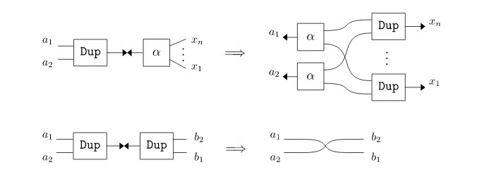

# Gentle introduction to Inpla
#### Contents in this section
* [Nets: terms and connections](#nets-terms-and-connections)
* [Interaction rules: rewriting rules for nets](#interaction-rules-rewriting-rules-for-nets)
  - [Example: Operations on unary natural numbers](#example-operations-on-unary-natural-numbers)
  - [Abbreviation notation `<<`](#abbreviation-notation-)
* [Built-in Agents](#built-in-agents)
  - [Tuples](#tuples)
  - [Lists](#lists)
  - [Built-in rules for tuples and lists](#built-in-rules-for-tuples-and-lists)
* [Attributes (integers)](#attributes-integers)
  - [Built-in anonymous agent for attributes](#built-in-anonymous-agent-for-attributes)
  - [Arithmetic expressions on attributes](#arithmetic-expressions-on-attributes)
  - [Interaction rules with expressions on attributes](#interaction-rules-with-expressions-on-attributes)
  - [Built-in rules of attributes in the anonymous agents](#built-in-rules-of-attributes-in-the-anonymous-agents)
  - [Interaction rules with conditions on attributes](#interaction-rules-with-conditions-on-attributes)
* [Commands](#commands)
* [Execution Options](#execution-options)
* [Advanced topics](#advanced-topics)
  - [Reuse annotations](#reuse-annotations)
  - [built-in agents more](#built-in-agents-more)
  - [Map and reduce functions (with Abbreviation notation `%`)](#map-and-reduce-functions)
  - [Weak reduction strategy](#weak-reduction-strategy)


## Nets: terms and connections

Inpla evaluates *nets*, which are built by *connections between terms*. First, we start learning about terms and connections.

### Terms

**Terms** are built on *names* and *agents* as follows:

```
<term> ::= <name> | <agent>
<name> ::= <nameID>
<agent> ::= <agentID>
          | <agentID> ['(' <term> ',' ... ',' <term> ')']     
```
* **Name**: It works as a buffer between terms. The ```<nameID>``` is defined as strings start with a small letter, e.g. ```x``` and ```y```. To show connected terms from names, type the names. For instance, type just `x` to show a term connected from the 'x':

  ```
  >>> x;
  <NON-DEFINED>
  >>>
  ```

  The above execution means that nothing has been connected from the `x` yet, of course.
  We have **Linearity restriction** for names such that **each name must occur at most twice**. This is required in order to ensure one-to-one connections between terms.

* **Agent**: It works as a constructor and de-constructor (defined functions). Generally agents have one *principal port* and *n*-fixed *auxiliary ports*. The fixed number of auxiliary ports is called *arity*, and it is determined according to each agent sort. In graphical representation an agent term `A(x1,...,xn)`, whose arity is *n*, is drawn as the following picture, where its auxiliary ports and the principal port (drawn as an arrow) correspond to the occurrences of the `x1`,...`xn`, and `A(x1,...,xn)`, respectively: 
  
  
  
  The ```<agentID>``` is defined as strings start with a capital letter, e.g. ```A``` and ```Succ```, and also ```<nameID>``` followed by a open curry bracket```(```. So, ```foo(x)``` is recognised as an agent. 

  

### Connections

A **connection** is a relation between two terms, that means the two term are connected, and it is expressed with the symbol `~`. For instance, a connection between a name `x` and an agent `A` (whose arity is 0) is denoted as `x~A`. There is no order in the left-hand and the right-hand side terms, thus `x~A` and `A~x` are identified as the same one.

* **Connections between a name and an agent** are evaluated as that the agent is connected from the name. For instance, `x~A` is evaluated as that the `A` is connected from the `x`.   Here, as an example, type `x~A` with the termination symbol `;` as follows:
  
  ```
  >>> x~A;
  (0 interactions, 0.00 sec)
  >>>
  ```
  
  To show the connected terms from the name x, type just `x`:  
  ```
  >>> x;
  A
  >>>
  ```
  
  To dispose the name `x` and anything connected from the `x`, use `free` command:
  ```
  >>> free x;
  >>> x;
  <NON-DEFINED>
  >>>
  ```


* **Connections between names** are evaluated as that ports corresponding to these names are connected mutually in interaction nets frameworks. However, in Inpla, these are evaluated as that, for the connections, the left-hand side name connects to the right-hand side name, thus only one way. For instance, `x~y` is evaluated that the `x` connects to the `y` (not that the `y` connects to `x`):

  ```
  >>> x~y;
  >>> x;
  y
  >>> y;
  <EMPTY>
  >>>
  ```

* **Connections between agents** are evaluated according to *interaction rules* explained later. 

Two connections that have the same name at the right or left hand sides, say `t~x` and `x~s`, are written as `t~s`.  **We note** that the `x` is disposed after rewriting so that every connection can be kept one-to-one via names, cannot be one-to-many.
```
>>> x~A, x~y;
(0 interactions, 0.00 sec)
>>> y;
A
>>> x;        // x has been consumed by the re-connection of x~A and x~y.
<NON-DEFINED>
>>>
```

Just in case for other examples, let the `y` disposed:

```
>>> free y;
>>> y;
<NON-DEFINED>
>>>
```


## Interaction rules: rewriting rules for nets

Connections between agents are rewritten according to **interaction rules**:

```
<interaction-rule> ::= <rule-agent> '><' <rule-agent> '=>' <connections> ';'
<rule-agent> ::= <agentID>
               | <agentID> '(' <name> ',' ... ',' <name> ')'
```
  with the **proviso** that:

  * each name that occur in the two `<rule-agent>` must be **distinct**
  * (**Linearity restriction**): every name in the `<interaction-rule>` must **occur twice**.

Something complicated? No problem! Let's us learn how to define the rules with some example!

### Example: Operations on unary natural numbers

Unary natural numbers are built by Z and S. For instance, 0, 1, 2, 3 are expressed as Z, S(Z), S(S(Z)), S(S(S(Z))). Here, let's think about an increment operation "inc" such that:
```
 inc(n) = S(n).
```

First, we will think about the relationship between constructors and deconstructors in  this computation.
Here, constructors are agents `Z`, `S(x)`, and a destructor is `inc(r)` which has an argument for the output. The behaviour of `inc(r)` will be as follows:
* When `inc(r)` meets `Z`, the output `r` is connected to `S(Z)`. 
* In the case of `S(x)`, the `r` is connected to `S(S(x))`. 


 This is written as the following rules:
```
inc(r) >< Z => r~S(Z);
inc(r) >< S(x) => r~S(S(x));
```

Let's check the rule proviso. In the first rule, the name `r` occurs twice, so it satisfies the proviso. The second rule is also OK because the `r` and `x` are distinct and occur twice in the rule. 

Since agents can work as both constructors and de-constructors, we should use capitalised strings such as `Z`, `S` and `Tree` for constructors, and lowercases for de-constructors such as `inc`.

Let's take the result of the increment operation for `S(S(Z))`:

```
>>> inc(r) >< Z => r~S(Z);
>>> inc(r) >< S(x) => r~S(S(x));
>>> inc(r)~S(S(Z));
(1 interactions, 0.01 sec)
>>> r;
S(S(S(Z))
>>>
```

Good! We get `S(S(S(Z)))` as the result of incrementation of  `S(S(Z))` .

To show the result as a natural number, use `prnat` command:

```
>>> prnat r;
3
>>>
```

Let's clean the result in case it could be used anywhere:

```
>>> free r;
>>>
```

* **Exercise**: Addition on unary natural numbers.

  It is defined recursively in term rewriting systems as follows:

  - add(x, Z) = x,  
  - add(x, S(y)) = add(S(x), y).
  
  This is written in interaction nets as follows: 
  
  In Inpla (and textual notation in interaction nets also), each agent is expressed as a term whose arguments correspond to its auxiliary ports. For instance, the `add` agent in the most left-hand side of the above figure, putting distinct names on auxiliary ports such as `ret` and `x`, is written as a term `add(ret,x)` by assembling these names anti-clockwise from the principal port (drawn as an arrow). 
  
  Every computation is performed on connections between principal ports according to interaction rules. The rules shown in above figure are written textually as follows:
  
  ```
  add(ret, x) >< Z => ret~x;
  add(ret, x) >< S(y) => add(ret, S(x))~y;
  ```
  The following is an execution example:
  ```
  >>> add(ret, x) >< Z => ret~x;
  >>> add(ret, x) >< S(y) => add(ret, S(x))~y;
  >>> add(r,S(Z))~S(S(Z));
  (2 interactions, 0.00 sec)
  >>> r;
  S(S(S(Z)))
  >>> prnat r;
  3
  >>> free r;
  >>>
  ```
  
* **Exercise**: Another version of the addition.

  There is another version as follows:

  - add(x,Z) = x,
  - add(x, S(y)) = S(add(x,y)).

  These are written in interaction nets: 
  
  and written textually as follows:
  
  ```
  add(ret,x) >< Z => ret~x;
  add(ret,x) >< S(y) => ret~S(cnt), add(cnt, x)~y;
  ```
  In comparison with the previous example, calculation results can be sent partially as `S(cnt)` to other soon, whereas those in the previous one are stored until all of computation finish. So, **this version is suitable for parallel execution**.
  
  
### Abbreviation notation `<<`: 
An abbreviation notation `<<` is defined as follows:
```
a,b,...,z << Agent(aa,bb,...,yy,zz)   == for ==  Agent(a,b,...,z,aa,bb,...,yy) ~ zz 
```
For instance, `r << add(S(Z),S(S(Z)))` is rewritten internally as `add(r,S(Z))~S(S(Z))`. It is handy to denote ports that take computation results.


## Built-in Agents
Inpla has built-in agents:

### Tuples

* `Tuple0`,  `Tuple2(x1,x2)`,  `Tuple3(x1,x2,x2)`,  `Tuple4(x1,x2,x3,x4)`,  `Tuple5(x1,x2,x3,x4,x5)`,   written as   `()`,  `(x1,x2)`,  `(x1,x2,x3)`, `(x1,x2,x3,x4)`, `(x1,x2,x3,x4,x5)`, respectively.
  
* There is no Tuple1. `(x)` is evaluated just as `x`.


### Lists

* `Nil`, `Cons(x,xs)`, written as  `[]` and `x:xs`, respectively. 
* A nested `Cons` terminated with `Nil` are written as a list notation using brackets `[` and `]`.  For instance,  `x1 : x2: x3 : Nil`  is written as  `[x1,x2,x3]` .  

### Built-in rules for tuples and lists

There are built-in rules for the same built-in agents that each element is matched and connected such that:

```
(x1,x2)><(y1,y2) => x1~y1, x2~y2 // This is already defined as a built-in rule.
```

* Examples of the built-in rules:

  ```
  >>> (x1,x2)~(Z, S(Z));
  (1 interactions, 0.00 sec)
  >>> x1 x2;
  Z S(Z)
  >>> free x1 x2;
  >>>
  ```

  ```
  >>> [y1, y2, y3]~[Z, S(Z), S(S(Z))];
  (4 interactions, 0.00 sec)
  >>> y1 y2 y3;
  Z S(Z) S(S(Z))
  >>> free y1 y2 y3;
  >>>
  ```

#### Append a list to the end of another list
We also have a built-in agent `Append` to append a list `listB` to the end of another list `listA` as shown in the following pseudo code:

```
Append(r, listB) ~ listA --> r ~ (listA ++ listB)  // pseudo code
```
The order `listB` and `listA` seems something strange, so a special abbreviation notation is prepared:
```
r << Append(listA, listB)   == for ==  Append(r, listB)~listA
```


  ```
  >>> Append(r, [Z, S(Z)]) ~ [A,B,C];
  (4 interactions, 0.00 sec)
  >>> r;
  [A,B,C,Z,S(Z)]
  >>> free r;
  >>>
  ```

* The abbreviation notation for the Append:
  ```
  >>> r << Append([A,B,C], [Z, S(Z)]);
  (4 interactions, 0.00 sec)
  >>> r;
  [A,B,C,Z,S(Z)]
  >>> free r;
  >>>
  ```

#### `Zip`: It makes two lists into a list of pairs
A built-in agent `Zip` takes two lists and returns a list whose elements are pairs of the given two lists elements such that:
```
Zip(r,[A,B,...])~[AA,BB,...] -->* r~[(A,AA),(B,BB),...].
```
The length of the result will be the same to the shorter one in the given lists:
```
Zip(r,[A,B])~[AA,BB,CC,...] -->* r~[(A,AA),(B,BB)].
```
We can write it with the abbreviation as well:
```
>>> r << Zip([A,B,C], [AA,BB,CC]);
(8 interactions, 0.00 sec)
>>> r; free r;
[(A,AA),(B,BB),(C,CC)]
>>>
```


### Eraser

* Eraser agent `Eraser` disposes any nets gradually:
  
  
  ```
  >>> Eraser ~ A(x1,x2);
  (1 interactions, 0.00 sec)
  >>> x1 x2;
  Eraser Eraser
  >>> free x1 x2;
  >>>
  ```


### Duplicator
* `Dup` agent duplicates any agents:
  
  ```
  >>> Dup(a1,a2) ~ [Z, S(Z), S(S(Z))];
  (10 interactions, 0.00 sec)
  >>> a1 a2;
  [Z,S(Z),S(S(Z))] [Z,S(Z),S(S(Z))]
  >>> free a1 a2;
  >>>
  ```


## Attributes (integers)

Agents are extended so that integers can be held on their ports. These integers are called *attributes*. 

* For instance, `A(100)` is an agent `A` that holds an attribute value `100`.

  ```
  >>> x~A(100);
  (0 interactions, 0.01 sec)
  >>> x;
  A(100);
  >>> free x;
  >>>
  ```


### Built-in anonymous agent for attributes
We can use integers the same as agents, and these are recognised as attributes of a built-in *anonymous agent* in Inpla. For instance, we can write `x~100` where the `100` is an attribute value of the anonymous agent. 


  ```
  >>> x~100;    // The `100' is regarded as an attribute of an anonymous agent
  (0 interactions, 0.00 sec)
  >>> x;
  100
  >>> free x;
  >>>
  ```


### Arithmetic expressions on attributes
It is possible to have attributes as calculation results of arithmetic operation using `where` statement after connections:  

```
<connections-with-expressions> ::= 
                         <connections> 
                       | <connections> 'where' <let-clause>* ';'
                       
<let-clause> ::= <name> '=' <arithmetic expression>
```

The symbol of addition, subtraction, multiplication, division, modulo are `+`, `-`, `*`, `/` and `%`, respectively. Relational operations `<`, `<=`, `>` and `>=` return 1 for True, 0 for False. Logical operations Not `!` (`not`), And `&&` (`and`)  and Or `||` (`or`) are also available where only `0` is regarded as False.

* Example: an expression using `where`:

  ```
  >>> x~A(a) where a=3+5;
  (0 interactions, 0.00 sec)
  >>> x;
  A(8)
  >>> free x;
  >>>
  ```

* Arithmetic expressions can be also written in arguments directly:

  ```
  >>> x~A(3+5);
  (0 interactions, 0.00 sec)
  >>> x;
  A(8)
  >>> free x;
  >>>
  ```


* Arithmetic expressions are also available for the anonymous agent:

  ```
  >>> x~(3+5);  // this is also written without brackets as x~3+5;
  (0 interactions, 0.00 sec)
  >>> x;
  8
  >>> free x;
  >>>
  ```


### Interaction rules with expressions on attributes
In interaction rules, attributes are recognised by using variables with a modifier `int` in the rule-agent parts , and we call these *attribute variables*. 
**Attribute variables has no Linear restriction** because these do not affect keeping the one-to-one connection among agent ports. So, we can use the same attribute variable as many times as we want.

* Example: Incrementor on an attribute:

  ```
  >>> inc(result) >< (int a) => result~(a+1);  // The `a' is a variable for an attribute
  >>> inc(r)~10;                               // This is also written as:  r << inc(10)
  (1 interactions, 0.00 sec)
  >>> r;
  11
  >>> free r;
  >>>
  ```


- Example: Duplicator of integer lists. 

  
  
  
  This has been implemented as a built-in agent `Dup`, but let's take it as an example that the same attribute variable occurs twice. On the first line of the following execution example, twice occurrences of *i*  in the right-hand side (here, `(i:xs1)` and `(i:xs2)`) is allowed in a rule. This is possible because the *i* is an attribute variable.

  ```
  >>> dup(a1,a2) >< (int i):xs => a1~(i:xs1), a2~(i:xs2), dup(xs1,xs2)~xs;
  >>> dup(a1,a2) >< []         => a1~[], a2~[];
  >>> dup(a,b) ~ [1,2,3];    // This is also written as:   a,b << dup([1,2,3])
  (2 interactions, 0.00 sec)
  >>> a b;
  [1,2,3] [1,2,3]
  >>> free a b;
  >>>
  ```
  
  

**We should be careful for operations of two attributes on distinct agents**. For instance, we take the following rule of an `add` agent, of course, it works as an addition operation on two attributes:

```
>>> add(result, int b) >< (int a) => result~(a+b);
>>> add(r, 3) ~ 5;
(1 interactions, 0.00 sec)
>>> r;
8
>>> free r;
>>>
```

However, it will cause a runtime error if the `add` rule is invoked without an attribute value on the second argument.  For instance, we take the following computation:

```
>>> b~1;
>>> add(r, b)~3;
>>> r;
47005050212003
>>>
```

This is because although it is not an attribute value, just a name, the `b` is recognised as an attribute value and the calculation is carried out.  To prevent this fragile situation, **we have to have extra rules to ensure that every port with the modifier `int` has been connected to an attribute**. For the rule of the `add`, the following is a **solution** to have the extra rule (the `addn` is introduced as the extra agent):

```
>>> add(result, b) >< (int a) => addn(result, a) ~ b;
>>> addn(result, int a) >< (int b) => r~(a+b);
```
Do not worry about it. Some built-in rules for arithmetic computations are prepared as follows:


### Built-in rules of attributes in the anonymous agents

There are built-in rules for arithmetic operations between two agents by using `Add`, `Sub`, `Mul`, `Div`, `Mod` agents as addition, subtraction, multiplication, division and modulo, respectively. Rules for the `Add` are defined so that it can join two attributes on distinct agents safely as follows, and the others are also defined the same way:

```
Add(result, y)><(int x) => _Add(result, x)~y;
_Add(result, int x)><(int y) => result~(x+y);
```

* Example:

  ```
  >>> Add(r,3)~5;    // Add is already defined as built-in.
  >>> r;
  8
  >>> Sub(r1, r)~2;  // It is also written as an abbreviation form: r1<<Sub(r,2);
  >>> r1;
  6
  >>>
  ```

  

### Interaction rules with conditions on attributes
Conditional rewritings on attributes are available. The following is a general form:  

```
<rule-with-conditions> ::= 
  <agent> '><' <agent>
  '|' <condition-on-attributes> '=>' <connections-with-expressions>
  '|' <condition-on-attributes> '=>' <connections-with-expressions>
      ...  
  '|' '_'  '=>' <connections-with-expressions> ';'
  
<condition-on-attributes> is an expression on attributes specified in the two <agent>.
```

The sequence of `<condition-on-attributes>` must be finished with the otherwise case `_`.

* Example: The following shows rules to obtain a list that contains only even numbers:

  ```
  // Rules
  evenList(result) >< [] => r~[];
  evenList(result) >< (int x):xs
  | x%2==0 => result~(x:cnt), evenList(cnt)~xs
  | _      => evenList(result)~xs;
  ```

  ```
  >>> evenList(r)~[1,3,7,5,3,4,9,10];
  >>> r;
  [4,10]
  >>> free r;
  >>>
  ```


- Example: Fibonacci number:

  ```
  fib(r) >< (int n)
  | n == 0 => r~0
  | n == 1 => r~1
  | _ => fib(r1)~(n-1), fib(r2)~(n-2), Add(r, r2)~r1;
  
  // * We cannot write result~(r1+r2) for Add(result, r2)~r1
  // because r1, r2 may have not been connected to attributes in the anonymous agents,
  // thus we have to leave the addition until both fib(r1)~(n-1), fib(r2)~(n-2) are finished.
  // For this purpose we have to use the addition operation between agents defined as 
  //   Add(result, y)><(int x) => _Add(result, x)~y;
  //   _Add(result, int x)><(int y) => result~(x+y);
  // By using Add(result, r2)~r1, 
  // after r1,r2 have been connected to (int x), (int y), respectively, 
  // x+y is executed and the calculation result is connected to the result safely.
  ```
  
  ```
  >>> fib(r)~39;
  >>> r;
  63245986
  >>> free r;
  >>>
  ```
  
  

## Commands

Inpla has the following commands:
* `free` *name1* ... *name_n* `;`     
  The *name1* ... *name_n* and connected terms from these are disposed. To dispose all living names and connected terms, type `free ifce;`, where the `ifce` is an abbreviation of *interface* that is called for the set of names that live and occur once.
  
* *name1* ... *name_n* `;`  
  Put terms connected from the *name1* ... *name_n*.
  
* `ifce;`

  Put every term connected from the interface.

* `prnat` *name*`;`    
  Put a term connected from the *name* as a natural number.
  
* `use` `"`*filename*`";`  
  Read the file whose name is *filename*. 
  
* `exit;`            
  Quit the system.

Inpla has the following macro:
* `const` *NAME*`=` *i* `;`  
    The *NAME*  is bound to the integer value *i* as immutable, and replaced with the value *i* in nets and interaction rules.


## Execution Options

* When invoking Inpla, you can specify the following options:

  ```
  $ ./inpla -h
  Inpla version 0.8.0
  Usage: inpla [options]
  
  Options:
   -f <filename>    Set input file name                     (Default:      STDIN)
   -d <Name>=<val>  Bind <val> to <Name>
   -Xms <num>       Set initial heap size to 2^<num>        (Default: 12 (=4096))
   -Xmt <num>       Set multiple heap increment to 2^<num>  (Default:  3 (=   8))
                      0: the same size heap is inserted when it runs up.
                      1: the twice (=2^1) size heap is inserted.
   -Xes <num>       Set initial equation stack size         (Default:        256)
    -w               Enable Weak Reduction strategy         (Default:      false)
   -t <num>         Set the number of threads               (Default:          8)
   -h               Print this help message
  ```

**Note**: 

* The option `-w` is available for the single-thread version.
* The option ```-t``` is available for the multi-thread version that is compiled by ```make thread```. The default value is setting for the number of cores, so execution will be automatically scaled without specifying this. 


## Advanced topics

### Reuse annotations
In interaction rule definitions, we can specify how active pair agents are reused by putting annotations `(*L)` and `(*R)` before agents in the right-hand side net. This annotations promote in-place computing, and as a result performance can be improved well  in parallel execution.

* For instance, in the rule `gcd(ret) >< (int a, int b)`, we can reuse the `gcd` and `Tuple2` in nets as follows:

  ```
  gcd(ret) >< (int a, int b)
  | b==0 => ret ~ a
  | _ => (*L)gcd(ret) ~ (*R)(b, a%b);
  ```


### Built-in agents more

* **Merger agent** `Merger`: 
  it merges two lists into one. Merger agent has two principal ports that can take the two distinct lists. Interactions with the lists are performed as soon as one of the principal ports is connected one of the lists. So, the merged result is non-deterministically decided, especially in multi-threaded execution.
  
  
  
  We overload `<<` in order to use the Merger agent naturally as follows:

  ```
  ret << Merger(alist, blist)
  ```

  The following is an execution example (the count of interactions is not supported yet):
  ```
  >>> r << Merger([0,0,0,0,0,0,0,0,0,0], [1,1,1,1,1,1,1,1,1,1]); 
  (1 interactions by 4 threads, 0.10 sec)
  >>> ifce;
  r 
  
  Connections:
  r ->[0,0,1,1,1,1,1,1,1,1,1,1,0,0,0,0,0,0,0,0]
  
  >>> 
  ```


### Map and reduce functions

* **Lambda-application-like computation**: We can leave an interaction later by using a couple of Tuple2 agents. For instance, an destructor agent `foo` whose arity is 1 can be abstracted as `(r, foo(r))`, and we can give a constructor `s` later:
  ```
  (r, foo(r)) >< (result, s) -->* foo(result)~s.
  
  // where the following rule has been defined as a built-in:
  // (a1,a2) ><> (b1,b2) => a1~b1, a2~b2.   
  ```
* **Map function operation**: So, the map function operation can be realised by a built-in `Map` agent with the following already defined rules:
  ```
  Map(result, f) >< []   => result~[], Eraser~f;
  Map(result, f) >< x:xs => Dup(f1,f2)~f, 
                            result~w:ws, 
                            f1 ~ (w, x), Map(ws, f2)~xs;
  ```
  Actually, by using the incrementor `inc` we can add one to each list element:
  ```
  inc(r)><(int i) => r~(i+1);
  Map( result, (r,inc(r)) ) ~ [10,20,30]
   -->   Dup(f1,f2)~(r,inc(r)), result~w:ws, f1~(w,10), Map(ws,f2)~[20,30]
   -->*  result~w:ws, (r1,inc(r1))~(w,10), Map( ws, (r2,inc(r2)) )~[20,30]
   -->*  result~w:ws, inc(w)~10, Map( ws, (r2,inc(r2)) )~[20,30]
   -->   result~w:ws, w~11, Map(ws, (r2,inc(r2)) )~[20,30]
   -->   result~11:ws, Map(ws, (r2,inc(r2)) )~[20,30]
   -->*  result~11:21:ws, Map(ws, (r3,inc(r3)) )~[30]
   -->*  result~11:21:31:ws, Map(ws, (r4,inc(r4)) )~[]
   -->*  result~[11,21,31];
  ```
  The Tuple2 agent seems a little complicated, so we prepare an abbreviation `%`. In the following, `foo1`, `foo2`, `foo3`, ... are any agents whose arity is 1, 2, 3, ..., respectively.
  ```
  The abbreviation form is decided according to the arity of a given agent to the %.
  %foo1  === (r, foo1(r))
  %foo2  === ((r,x), foo2(r,x))
  %foo3  === ((r,x,y), foo3(r,x,y))
  %foo4  === ((r,x,y,z), foo4(r,x,y,z))
  %foo5  === ((r,x,y,z,zz), foo5(r,x,y,z,zz))
    where r,x,y,z,zz are fresh names.
  ```
  For instance, by using %five we can write the following computation simply:
  ```
  %five ~ ((result,1,2,3,4), 5) -->* five(result,1,2,3,4)~5.
  ```
  This is quite useful for the map application. The `inc` application is written simply as follows:
  ```
  >>> Map(result, %inc) ~ [1,2,3];
  >>> result;
  [2,3,4]
  >>>
  ```
  Wonderful!

* **Reduce function operation**: The same as the map operation, we can define foldr and foldl as follows (Do not worry if it looks complicated. It is OK if we can just use these!):
  ```
  // --------------------------------------------------------------------
  // foldr f v [x0, x1, ..., xn] = f(x0, f(x1, ... f(xn-1, f(xn, v))...))
  // --------------------------------------------------------------------
  foldr(r, f, v) >< x:xs => foldr_Cons(r,f,v,x)~xs;
  foldr_Cons(r,f,v,x) >< [] => f~((r,x),v);
  foldr_Cons(r,f,v,x) >< y:ys => 
           Dup(f1,f2)~f,
           foldr(w, f2, v)~y:ys,
           f1~((r,x),w);
  
  // --------------------------------------------------------------------
  // foldl f v [x0, x1, ..., xn] = f( ... f(f(v,x0),x1) ..., xn)
  // --------------------------------------------------------------------
  foldl(r, f, v) >< x:xs => foldl_Cons(r,f,v,x)~xs;    
  foldl_Cons(r,f,v,x) >< [] => f~((r,v),x);
  foldl_Cons(r,f,v,x) >< y:ys => 
           Dup(f1,f2)~f,
           f1~((w,v),x),
           foldl(r, f2, w)~y:ys;
  ```
  These can be used quite simply:
  ```
  >>> foldr(r, %Sub, 1) ~ [30,20,10];  // 30-(20-(10-1)) = 30-(20-9) = 30-11 = 19
  (17 interactions, 0.00 sec)
  >>> r; free r;
  19
  >>> foldl(r, %Sub, 10) ~ [1,2,3]; //  ((10-1)-2)-3 = 4
  (17 interactions, 0.00 sec)
  >>> r; free r;
  4
  >>>
  ```


### Weak reduction strategy

In this reduction strategy, only connections that have interface names (thus, live and occur once) are evaluated. This is taken for non-terminate computation such as fixed point combinator and process networks.

* Example: We have a sample net in `sample/processnet1.in` that keep producing natural numbers from 1 and output these to the port `r`:

  ```
  // Rules
  dup(a1,a2) >< (int i):xs => a1~(i:xs1), a2~(i:xs2), dup(xs1,xs2)~xs;
  dup(a1,a2) >< []         => a1~[], a2~[];
  
  inc(r) >< (int i):xs => r~(i+1):w, inc(w)~xs;
  inc(r) >< []         => r~[];
  
  // Nets
  dup(r,w)~r1, inc(r1) ~ 0:w;
  
  //       +-----+       +-----+        +---+
  // r ----|     |  r1   |     |        |   |
  //       | dup |--->---| inc |---><---| 0 |----+
  //   +---|     |       |     |        |   |    |
  //   |   +-----+       +-----+        +---+    |
  //   |                                         |
  //   +-----------------------------------------+
  //             w
  ```

  This reduction strategy is available by invoking with `-w` option as follows:

  ```
  $ ./inpla -w
  Inpla 0.5.0 (Weak Strategy) : Interaction nets as a programming language [28 Oct. 2021]
  >>> use "sample/processnet1.in";
  (2 interactions, 0.00 sec)
  >>> ifce;
  r 
  
  Connections:
  r ->[1,<a1>...    // this means a list of 1 and something.
  
  >>> a:b ~ r;
  (2 interactions, 0.00 sec)
  >>> ifce;
  a b 
  
  Connections:
  a ->1
  b ->[2,<b1>...  
  
  >>>
  ```
