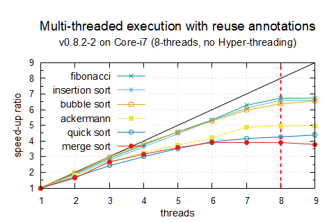
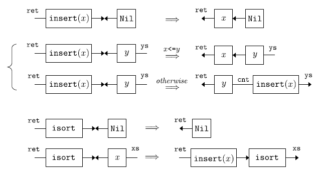
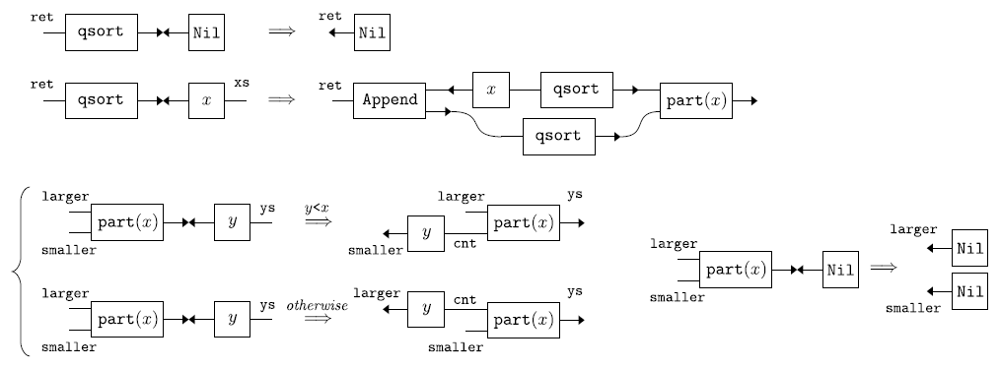

# Inpla: Interaction nets as a programming language 


## What is Inpla

Inpla is a multi-threaded parallel interpreter of interaction nets. Once you write programs for sequential execution, it works also in multi-threaded parallel execution. Each thread is managed on each CPU-core with POSIX-thread library. 

* The current version is 0.9.2-1 (bugfix), released on **2 August 2022**. (See [Changelog.md](Changelog.md) for details.) 
* The below graph shows speed-up ratio to threads numbers for programs in the following benchmark table.




- **Comparison in execution time** with other implementations: **Haskell** (GHC version 8.10.7), **OCaml** (ocamlopt, the native-code compiler, version 4.08.1), **Standard ML of New Jersey** v110.74 (interpreter mode) and **Python** 3.8.5 in execution time.


|                | Haskell  |   OCaml   |   SML    | Python | Inpla8 | Inpla8r |
| -------------- | :------: | :------: | :----: | :----: | :------: | :------: |
| ack(3,11)    |   [2.30](comparison/Haskell/ack3-11.hs)   | [0.46](comparison/OCaml/ack3_11.ml) | [**0.43**](comparison/SML/ack3-11.sml) |   [-](comparison/Python/ack3-11.py)    |  [0.86](comparison/Inpla/src/ack-stream_3-11.in)  |   [0.71](comparison/Inpla/src/ack-stream_3-11-reuse.in)   |
| fib 38       |   [1.60](comparison/Haskell/fib38.hs)   | [**0.15**](comparison/OCaml/fib38.ml) | [0.27](comparison/SML/fib38.sml) |  [8.88](comparison/Python/fib38.py)  |  [0.40](comparison/Inpla/src/fib-38.in)  |   [0.43](comparison/Inpla/src/fib-38-reuse.in)   |
| bsort 20000 |  [4.98](comparison/Haskell/bsort-40000.hs)  |  [6.78](comparison/OCaml/bsort40000.ml)  |  [2.38](comparison/SML/bsort-40000.sml)  | [19.91](comparison/Python/bsort-40000.py) |  [2.16](comparison/Inpla/src/bsort-20000.in)  | [**1.58**](comparison/Inpla/src/bsort-20000-reuse.in) |
| isort 20000 | [2.15](comparison/Haskell/isort-40000.hs) |   [1.52](comparison/OCaml/isort40000.ml)   |   [0.60](comparison/SML/isort-40000.sml)   | [9.58](comparison/Python/isort-40000.py) |  [**0.29**](comparison/Inpla/src/isort-40000.in)  |   [0.33](comparison/Inpla/src/isort-40000-reuse.in)   |
| qsort 260000 | [0.34](comparison/Haskell/qsort-800000.hs) |   [0.25](comparison/OCaml/qsort800000.ml)   |   [0.27](comparison/SML/qsort-800000.sml)   | [10.40](comparison/Python/qsort-800000.py) |  [0.15](comparison/Inpla/src/qsort-800000.in)  |   [**0.11**](comparison/Inpla/src/qsort-800000-reuse.in)   |
| msort 260000 | [0.39](comparison/Haskell/msort-800000.hs) |   [0.29](comparison/OCaml/msort800000.ml)   |   [0.26](comparison/SML/msort-800000.sml)   | [10.96](comparison/Python/msort-800000.py) |  [**0.15**](comparison/Inpla/src/msort-800000.in)  |   [**0.15**](comparison/Inpla/src/msort-800000-reuse.in)   |


  - The above table contains execution time in second on average of ten times execution by using Linux PC (Core i7-9700 (8 threads, no Hyper-threading), 16GB memory). The fastest one is shown with bold style.  Scripts for the comparison table are in the `comparison` directory.
  
  - Inpla8  and Inpla8r mean 8 threads without/with [reuse-annotated](./Gentle_introduction_Inpla.md#reuse-annotations) execution, respectively. 
  
  - "ack(3,11)" is computation of Ackermann function.  Execution time of Python is a blank due to stack size limitation error. 
  
  - "fib 38" is computation to get the 38th Fibonacci number. 
  
  - "bsort *n*", "isort *n*", "qsort *n*" and "msort *n*" are computation of bubble sort, insertion sort, quick sort and merge sort for random *n*-element lists, respectively, followed by a validation check process.
    In the graph quick sort and merge sort are for 800000 elements because the 260000 elements are too small for Inpla to show the performance in parallel. See the description of v0.8.2-1 in [Changelog.md](./Changelog.md) for details. 


## Contents
* [Getting Started](#getting-started)
* [How to Execute](#how-to-execute)
  - [Interactive mode (single-thread version)](#interactive-mode-single-thread-version)
  - [Interactive mode (multi-thread version)](#interactive-mode-multi-thread-version)
  - [Batch mode and sample files](#batch-mode-and-sample-files)
* [How to write programs in Inpla](#how-to-write-programs-in-inpla)
* [Updates](#updates)
* [Publications](#publications)
* [Related Works](#related-works)
* [License](#license)


## Getting Started

* Requirement 
  - gcc (>= 4.0), flex, bison

* Build 
  - Single-thread version: Use `make` command as follows (the symbol `$` means a shell prompt):
  
    ```
    $ make
    ```

  - Multi-thread version: Use `make` with `thread` option:  
  
    ```
    $ make thread
    ```
     To get the single-thread version again, use `make clean; make`.

## How to Execute

### Interactive mode (single-thread version)
* Inpla starts in the interactive mode by typing the following command (where the symbol `$` is a shell prompt):
	
	```
	$ ./inpla
	Inpla 0.8.0 : Interaction nets as a programming language [built: 27 Feb. 2022]
	>>> 
	```


* The symbol `>>>` is a prompt of Inpla. After the prompt you can write rules and nets. For instance, the following is a rule for incrementation `inc`  and a net to bind the increment result of `10` to a name `r`  (where `//` is a comment):

  ```
  >>> inc(ret) >< (int i) => ret~(i+1);   // a rule for inc >< (int i)
  >>> inc(r)~10;                          // a net
  (1 interactions, 0.16 sec)
  >>> r;                                  // show a connected net from the r
  11
  >>> 
  ```

* To quit this system, use `exit` command:

  ```
  >>> exit;
  ```

### Interactive mode (multi-thread version)
* There is an execution option `-t` that specifies the number of threads in a thread pool. For instance, by invoking with `-t 4` Inpla populates 4 threads in the pool:

  ```
  $ ./inpla -t 4
  ```
  The default value is setting for the number of cores, so **execution will be automatically scaled without specifying this**. This is useful to see the effect by number of threads. 


### Batch mode and sample files
* Inpla has also the batch mode in which a file is evaluated. This is available when invoked with an execution option `-f`  *filename*. There are sample files in the `sample` folder. Here we introduce some of ones:

#### Greatest common divisor

* Sample file: `sample/gcd.in`

    ```
    // Example program in Python
    // def gcd(a: Int, b: Int): Int =
    //   if (b==0) a else gcd(b, a%b)
    
    // Rules
    gcd(ret) >< (int a, int b)
    | b==0 => ret ~ a
    | _ => gcd(ret) ~ (b, a%b);
    
  // Nets
  gcd(r) ~ (14,21);
  r; // it should be 7
  ```
  
  - Execution:
  
    ```
    $ ./inpla -f sample/gcd.in
    Inpla 0.8.0 : Interaction nets as a programming language [built: 27 Feb. 2022]
    (4 interactions, 0.00 sec)
    7
    
    $
    ```
  
  

#### Insertion sort

* Sample file: `sample/isort.in`

    ```
    // Rules
    insert(ret, int x) >< [] => ret~[x];
    insert(ret, int x) >< (int y):ys
    | x<=y => ret~(x:y:ys)
    | _    => ret~(y:cnt), insert(cnt, x)~ys;
    
    isort(ret) >< [] => ret~[];
    isort(ret) >< x:xs => insert(ret, x)~cnt, isort(cnt)~xs;
    
    
    // Nets
    isort(r)~[3,6,1,9,2];
    r;
    ```

  - Execution:

    ```
    $ ./inpla -f sample/isort.in
    Inpla 0.8.0 : Interaction nets as a programming language [built: 27 Feb. 2022]
    (16 interactions, 0.00 sec)
    [1,2,3,6,9]
    
    $
    ```

#### Quick sort

* Sample file: `sample/qsort.in`

    ```
    // Rules
    qsort(ret) >< [] => ret~[];
    qsort(ret) >< (int x):xs =>
    	ret << Append(left, x:right), part(smaller, larger, x)~xs,
    	qsort(left)~smaller, qsort(right)~larger;
    
    // Note: `Append' is implemented as the following built-in agent:
    //   Append(ret, b)~a  -->  ret ~ a++b
    // The ret << Append(left, x:right) is rewritten 
    // by the built-in abbreviation into:
    //   Append(ret, x:right)~left.
    
    part(smaller, larger, int x) >< [] => smaller~[], larger~[];
    part(smaller, larger, int x) >< (int y):ys
    | y<x => smaller~(y:cnt), part(cnt, larger, x)~ys
    | _   => larger~(y:cnt), part(smaller, cnt, x)~ys;
    
    
    // Nets
    qsort(r)~[3,6,1,9,2];
    r;
    ```

    These rules and nets are also written by using abbreviation:

    - Abbreviation notation version: 

      An abbreviation notation `<<` is introduced in v.0.5.0. We can write also as follows by the `<<`:
      ```
      a,b,...,z << Agent(aa,bb,...,yy,zz)   == for ==  Agent(a,b,...,z,aa,bb,...,yy) ~ zz 
      ```

      For instance, `r << Add(1,2)` is rewritten internally as `Add(r,1)~2`. It is handy to denote ports that take computation results. The following is another version by using the abbreviation:
    
      ```
      // Rules
      qsort(ret) >< [] => ret~[];
      qsort(ret) >< (int x):xs =>
      	ret << Append(left, x:right), 
      	smaller, larger << part(x,xs),
      	left << qsort(smaller), right << qsort(larger);
      
      part(smaller, larger, int x) >< [] => smaller~[], larger~[];
      part(smaller, larger, int x) >< (int y):ys
      | y<x => smaller~(y:cnt),  
               cnt, larger << part(x,ys)
      | _   => larger~(y:cnt), 
               smaller, cnt << part(x,ys);
      
      // Nets
      r << qsort([3,6,1,9,2]);
      r;
      ```
    
    - Execution:

      ```
      $ ./inpla -f sample/qsort.in
      Inpla 0.8.0 : Interaction nets as a programming language [built: 27 Feb. 2022]
      (22 interactions, 0.00 sec)
      [1,2,3,6,9]
      
      $
      ```


#### Other samples
* Evaluation of a lambda term `245II` in [YALE encoding](http://dl.acm.org/citation.cfm?id=289434), where `2`, `4`, `5` mean church numbers of lambda terms, and  `I` is a lambda term $\lambda x.x$:
  
      $ ./inpla -f sample/245II.in


* Samples of linear systemT encoding (see [our paper](http://link.springer.com/chapter/10.1007%2F978-3-319-29604-3_6) presented at [FLOPS 2016](http://www.info.kochi-tech.ac.jp/FLOPS2016/)).
  
      $ ./inpla -f sample/linear-systemT.in
  
  


## How to write programs in Inpla
[Gentle_introduction_Inpla.md](Gentle_introduction_Inpla.md) explains how to make programs in Inpla step by step. Please look it over!


## Updates

See [Changelog.md](Changelog.md) for details.


## Publications
* [1] Ian Mackie, Shinya Sato, 
[*In-place Graph Rewriting with Interaction Nets*](https://arxiv.org/abs/1609.03641), TERMGRAPH 2016, EPTCS 225, pp.15-24, 2016.
* [2] Shinya Sato,
[*Design and implementation of a low-level language for interaction nets*](http://sro.sussex.ac.uk/54469/),
PhD Thesis, University of Sussex, September 2014. 
* [3] Abubakar Hassan, Ian Mackie and Shinya Sato,
[*An implementation model for interaction nets*](http://arxiv.org/abs/1505.07164),
Proceedings 8th International Workshop on Computing with Terms and Graphs, TERMGRAPH 2014, EPTCS 183, May 2015. 
* [4] Ian Mackie and Shinya Sato,
[*Parallel Evaluation of Interaction Nets: Case Studies and Experiments*](http://journal.ub.tu-berlin.de/eceasst/article/view/1034),
Electronic Communications of the EASST, Volume 73: Graph Computation Models - Selected Revised Papers from GCM 2015, March 2016. 


## Related Works

* [HINet: Interaction Nets in Haskell](http://www.cas.mcmaster.ca/~kahl/Haskell/HINet/)


## License

Copyright (c) 2022 [Shinya Sato](http://satolab.com/) 
 Released under the MIT license 
 http://opensource.org/licenses/mit-license.php
