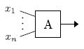
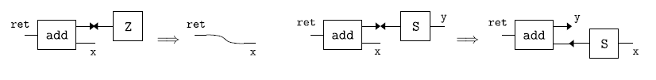
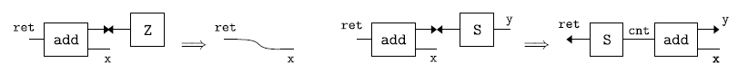
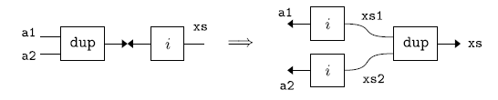
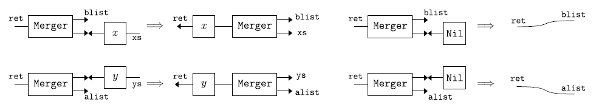

# Inpla: Interaction nets as a programming language


## What is Inpla

Inpla is a multi-threaded parallel interpreter of interaction nets. Once you write programs for sequential execution, it works also in multi-threaded parallel execution. Each thread is managed on each CPU-core with POSIX-thread library.


|                | Haskell  |   SML    | Python | Inpla1 | Inpla1_r | Inpla7 | Inpla7_r |
| -------------- | :------: | :------: | :----: | :----: | :------: | :----: | :------: |
| ack(3,11)    |   2.31   | **0.41** |   -    |  4.76  |   4.36   |  0.98  |   0.88   |
| fib 38       |   1.60   | **0.26** |  8.49  |  3.59  |   3.56   |  0.56  |   0.54   |
| bsort 40000  |  34.81   |  11.17   | 76.72  | 22.85  |  18.40   |  5.53  | **2.94** |
| isort 40000  | **0.02** |   2.97   | 36.63  | 10.59  |   8.74   |  2.59  |   1.43   |
| qsort 800000 | **0.15** |   1.16   | 97.30  |  1.85  |   1.55   |  0.76  |   0.41   |
| msort 800000 | **0.46** |   1.00   | 98.27  |  1.18  |   1.34   |  0.65  |   0.49   |

- **Comparison in execution time** with other implementations: **Haskell** (GHC version 8.10.7), **Standard ML of New Jersey** v110.74 (interpreter mode) and **Python** 3.8.5 in execution time.
  
  - The above table contains execution time in second on average of ten times execution by using Linux PC (Core i7-9700 (8 threads, no Hyper-threading), 16GB memory). The fastest one is shown with bold style.  Scripts for the comparison table are in the `comparison` directory.
  
  - Inpla*n*  and Inpla*n*_**r** mean *n* threads without/with reuse-annotated execution, respectively. 
  
  - "ack(3,11)" is computation of Ackermann function.  Execution time of Python is a blank due to stack size limitation error. 
  
  - "fib 38" is computation to get the 38th Fibonacci number. 
  
  - "bsort *n*", "isort *n*", "qsort *n*" and "msort *n*" are computation of bubble sort, insertion sort, quick sort and merge sort for random *n*-element lists, respectively.
  
    

## Contents
* [Getting Started](#getting-started)
* [How to Execute](#how-to-execute)
  - [Interactive mode (single-thread version)](#interactive-mode-single-thread-version)
  - [Interactive mode (multi-thread version)](#interactive-mode-multi-thread-version)
  - [Batch mode and sample files](#batch-mode-and-sample-files)
  - [Execution Options](#execution-options)
* [Introduction to Programming in Inpla](#introduction-to-programming-in-inpla)
* [Commands](#commands)
* [Updates](#updates)
* [Publications](#publications)
* [Related Works](#related-works)
* [License](#license)


## Getting Started
* Requirement 
  - gcc (>= 4.0), flex, bison

* Build 
  - Single-thread version: Use `make` command as follows (the symbol `$` means a shell prompt):
  
    ```
    $ make
    ```

  - Multi-thread version: Use `make` with `thread` option:  
  
    ```
    $ make thread
    ```
     To get the single-thread version again, use `make clean; make`.

## How to Execute

### Interactive mode (single-thread version)
* Inpla starts in the interactive mode by typing the following command (where the symbol `$` is a shell prompt):
	
	```
	$ ./inpla
	Inpla 0.5.0 : Interaction nets as a programming language [built: 28 Oct. 2021]
	>>> 
	```


* The symbol `>>>` is a prompt of Inpla. After the prompt you can write rules and nets. For instance, the following is a rule for incrementation `inc`  and a net to bind the increment result of `10` to a name `r`  (where `//` is a comment):

  ```
  >>> inc(ret) >< (int i) => ret~(i+1);   // a rule for inc >< (int i)
  >>> inc(r)~10;                          // a net
  (1 interactions, 0.16 sec)
  >>> r;                                  // show a connected net from the r
  11
  >>> 
  ```

* To quit this system, use `exit` command:

  ```
  >>> exit;
  ```

### Interactive mode (multi-thread version)
* There is an execution option `-t` in order to specify the number of threads in a thread pool. For instance, by invoking with `-t 4` Inpla starts with 4 threads in the pool:

  ```
  $ ./inpla -t 4
  ```


### Batch mode and sample files
* Inpla has also the batch mode in which a file is evaluated. This is available when invoked with an execution option `-f`  *filename*. There are sample files in the `sample` folder. Here we introduce some of ones:

#### Greatest common divisor

* Sample file: `sample/gcd.in`

    ```
    // Example program in Python
    // def gcd(a: Int, b: Int): Int =
    //   if (b==0) a else gcd(b, a%b)
    
    // Rules
    gcd(ret) >< (int a, int b)
    | b==0 => ret ~ a
    | _ => gcd(ret) ~ (b, a%b);
    
  // Nets
  gcd(r) ~ (14,21);
  r; // it should be 7
  ```
  
  - Execution:
  
    ```
    $ ./inpla -f sample/gcd.in
    Inpla 0.5.0 : Interaction nets as a programming language [built: 28 Oct. 2021]
    (4 interactions, 0.00 sec)
    7
    
    $
    ```
  
  

#### Insertion sort

* Sample file: `sample/isort.in`

    ```
    // Rules
    insert(ret, int x) >< [] => ret~[x];
    insert(ret, int x) >< (int y):ys
    | x<=y => ret~(x:y:ys)
    | _    => ret~(y:cnt), insert(cnt, x)~ys;
    
    isort(ret) >< [] => ret~[];
    isort(ret) >< x:xs => insert(ret, x)~cnt, isort(cnt)~xs;
    
    
    // Nets
    isort(r)~[3,6,1,9,2];
    r;
    ```

  - Execution:

    ```
    $ ./inpla -f sample/isort.in
    Inpla 0.5.0 : Interaction nets as a programming language [built: 28 Oct. 2021]
    (16 interactions, 0.00 sec)
    [1,2,3,6,9]
    
    $
    ```

#### Quick sort

* Sample file: `sample/qsort.in`

    ```
    // Rules
    qsort(ret) >< [] => ret~[];
    qsort(ret) >< (int x):xs =>
    	ret << Append(left, x:right), part(smaller, larger, x)~xs,
    	qsort(left)~smaller, qsort(right)~larger;
    
    // Note: `Append' is implemented as the following built-in agent:
    //   Append(ret, b)~a  -->  ret ~ a++b
    // The ret << Append(left, x:right) is rewritten 
    // by the built-in abrreviation into:
    //   Append(ret, x:right)~left.
    
    part(smaller, larger, int x) >< [] => smaller~[], larger~[];
    part(smaller, larger, int x) >< (int y):ys
    | y<x => smaller~(y:cnt), part(cnt, larger, x)~ys
    | _   => larger~(y:cnt), part(smaller, cnt, x)~ys;
    
    
    // Nets
    isort(r)~[3,6,1,9,2];
    r;
    ```

    These rules and nets are also written by using abbreviation:

    - Abbreviation notation version: 

      An abbreviation notation `<<` is introduced in v.0.5.0. We can write also as follows by the `<<`:
      ```
      a,b,...,z << Agent(aa,bb,...,yy,zz)   == for ==  Agent(a,b,...,z,aa,bb,...,yy) ~ zz 
      ```

      For instance, `r << Add(1,2)` is rewritten internally as `Add(r,1)~2`. It is handy to denote ports that take computation results. The following is another version by using the abbreviation:
    
      ```
      // Rules
      qsort(ret) >< [] => ret~[];
      qsort(ret) >< (int x):xs =>
      	ret << Append(left, x:right), 
      	smaller, larger << part(x,xs),
      	left << qsort(smaller), right << qsort(larger);
      
      part(smaller, larger, int x) >< [] => smaller~[], larger~[];
      part(smaller, larger, int x) >< (int y):ys
      | y<x => smaller~(y:cnt),  
               cnt, larger << part(x,ys)
      | _   => larger~(y:cnt), 
               smaller, cnt << part(x,ys);
      
      // Nets
      r << isort([3,6,1,9,2]);
      r;
      ```
    
    - Execution:

      ```
      $ ./inpla -f sample/qsort.in
      Inpla 0.5.0 : Interaction nets as a programming language [built: 28 Oct. 2021]
      (22 interactions, 0.00 sec)
      [1,2,3,6,9]
      
      $
      ```


#### Other samples
* Evaluation of a lambda term `245II` in [YALE encoding](http://dl.acm.org/citation.cfm?id=289434), where `2`, `4`, `5` mean church numbers of lambda terms, and  `I` is a lambda term $\lambda x.x$:
  
      $ ./inpla -f sample/245II.in


* Samples of linear systemT encoding (see [our paper](http://link.springer.com/chapter/10.1007%2F978-3-319-29604-3_6) presented at [FLOPS 2016](http://www.info.kochi-tech.ac.jp/FLOPS2016/)).
  
      $ ./inpla -f sample/linear-systemT.in
  
  

### Execution Options

* When invoking Inpla, you can specify the following options:

  ```
  $ ./inpla -h
  Inpla version 0.5.3
  Usage: inpla [options]
  
  Options:
   -f <filename>    Set input file name            (Defalut:    STDIN)
   -c <number>      Set the size of term cells     (Defalut:   100000)
   -x <number>      Set the size of the EQ stack   (Default:    10000)
   -t <number>      Set the number of threads      (Default:        1)
   -d <Name>=<val>  Bind <val> to <Name>
   -h               Print this help message
  ```

  (The option ```-t``` is available for the multi-thread version that is compiled by ```make thread```.)


# Introduction to Programming in Inpla
#### Contents in this section
* [Nets: terms and connections](#nets-terms-and-connections)
* [Interaction rules: rewriting rules for nets](#interaction-rules-rewriting-rules-for-nets)
  - [Example: Operations on unary natural numbers](#example-operations-on-unary-natural-numbers)
* [Built-in Agents](#built-in-agents)
* [Attributes (integers)](#attributes-integers)
  - [Built-in anonymous agent for attributes](#built-in-anonymous-agent-for-attributes)
  - [Arithmetic expressions on attributes](#arithmetic-expressions-on-attributes)
  - [Interaction rules with expressions on attributes](#interaction-rules-with-expressions-on-attributes)
  - [Built-in rules of attributes in the anonymous agents](#built-in-rules-of-attributes-in-the-anonymous-agents)
  - [Interaction rules with conditions on attributes](#interaction-rules-with-conditions-on-attributes)


## Nets: terms and connections

Inpla evaluates *nets*, which are built by *connections between terms*. First, we start learning about terms and connections.

### Terms

**Terms** are built on *names* and *agents* as follows:

```
<term> ::= <name> | <agent>
<name> ::= <nameID>
<agent> ::= <agentID>
          | <agentID> ['(' <term> ',' ... ',' <term> ')']     
```
* **Name**: It works a buffer between terms and **the same name must occur at most twice in order to ensure one-to-one connections between terms**. The ```<nameID>``` is defined as strings start with a small letter, e.g. ```x``` and ```y```. To show connected terms from names, type the names. For instance, type just `x` to show a term connected from the 'x':

  ```
  >>> x;
  <NON-DEFINED>
  >>>
  ```

  This means that nothing has not been connected from the `x` yet, of course.

  

* **Agent**: It works constructors and de-constructors (defined functions). Generally agents have one *principal port* and *n*-fixed *auxiliary ports*. The fixed number of auxiliary ports is called *arity*, and it is determined according to each agent sort. In graphical representation an agent term `A(x1,...,xn)`, whose arity is *n*, is drawn as the following picture, where its auxiliary ports and the principal port (drawn as an arrow) correspond to the occurrences of the `x1`,...`xn`, and `A(x1,...,xn)`, respectively: 
  
  
  
  The ```<agentID>``` is defined as strings start with a capital letter, e.g. ```A``` and ```Succ```, and also ```<nameID>``` followed by a open curry bracket```(```. So, ```foo(x)``` is recognised as an agent. 

  

### Connections

A **connection** is a relation between two terms, that means the two term are connected, and it is expressed with the symbol `~`. For instance, a connection between a name `x` and an agent `A` (whose arity is 0) is denoted as `x~A`. There is no order in the left-hand and the right-hand side terms, thus `x~A` and `A~x` are identified as the same one.

* **Connections between a name and an agent** are evaluated as that the agent is connected from the name. For instance, `x~A` is evaluated as that the `A` is connected from the `x`.   Here, as an example, type `x~A` with the termination symbol `;` as follows:
  
  ```
  >>> x~A;
  (0 interactions, 0.00 sec)
  >>>
  ```
  
  To show the connected terms from the name x, type just `x`:  
  ```
  >>> x;
  A
  >>>
  ```
  
  To dispose the name `x` and anything connceted from the `x`, use `free` command:
  ```
  >>> free x;
  >>> x;
  <NON-DEFINED>
  >>>
  ```


* **Connections between names** are evaluated as that ports corresponding to these names are connected mutually in interaction nets frameworks. However, in Inpla, these are evaluated as that, for the connections, the left-hand side name connects to the right-hand side name, thus only one way. For instance, `x~y` is evaluated that the `x` connects to the `x` (not that the `y` connects to `x`):

  ```
  >>> x~y;
  >>> x;
  y
  >>> y;
  <EMPTY>
  >>>
  ```

* **Connections between agents** are evaluated according to *interaction rules* explained later. 

One more connections are also evaluated. Connections whose the left-hand side is a name, such as `x~t`,  are disposed and another occurrence `x` in other connections, if exists, is replaced with the `t`.  For instance, `x~A, x~y` are evaluated as `A~y` by replacing `x` with `A`, or possibly `y~A` by replacing the `x` with `y` when the second connection `x~y` is used.  **We note** that the `x` is disposed because it is consumed by the substitution. Thus, **every connection is kept one-to-one via names, cannot be one-to-many**.
```
>>> x~A, x~y;
(0 interactions, 0.00 sec)
>>> y;
A
>>> x;        // x has been consumed by the re-connection of x~A and x~y.
<NON-DEFINED>
>>>
```

Just in case for other examples, let the `y` disposed:

```
>>> free y;
>>> y;
<NON-DEFINED>
>>>
```


## Interaction rules: rewriting rules for nets

Connections between agents are re-written according to **interaction rules**:

```
<interaction-rule> ::= <rule-agent> '><' <rule-agent> '=>' <connections> ';'
<rule-agent> ::= <agentID>
               | <agentID> '(' <name> ',' ... ',' <name> ')'
```
  with the **priviso** that:

  * each name that occur in `<rule-agent>` must be **distinct**
  * (**Linearity restriction**): every name in `<interaction-rule>` must **occur twice**.

Something complicated? No problem! Let's us learn how to define the rules with some example!

### Example: Operations on unary natural numbers

Unary natural numbers are built by Z and S. For instance, 0, 1, 2, 3 are expressed as Z, S(Z), S(S(Z)), S(S(S(Z))). Here, let's think about an increment operation `inc` such that inc(n) = S(n). This is written as rules for Z and S(x) as follows:

```
inc(ret) >< Z => ret~S(Z);
inc(ret) >< S(x) => ret~S(S(x));
```

In the first rule, the name `ret` occurs twice, so it satisfies the rule proviso. The second rule also satisfies because the `ret` and `x` are distinct names and occur twice in the rule. 

When agents works can be separated into constructors and de-constructors, it could be good to use strings of all small letters for de-constructors such as `inc` , and for constructors ones start from a capital letter such as `Z` and `S`.

Let's take the result of the increment operation for `S(S(Z))`:

```
>>> inc(r)~S(S(Z));         // This is also written as:  r << inc(S(S(Z)))
(1 interactions, 0.01 sec)
>>> r;
S(S(S(Z))
>>>
```

Good! We get `S(S(S(Z)))` as the result of incrementation of  `S(S(Z))` .

To show the result as a natural number, use `prnat` command:

```
>>> prnat result;
3
>>>
```

Let's clean the result in case it could be used anywhere:

```
>>> free r;
>>>
```

* **Exercise**: Addition on unary natural numbers.

  It is defined recursively in term rewriting systems as follows:

  - add(x, Z) = x,  
  - add(x, S(y)) = add(S(x), y).
  
  This is written in interaction nets as follows: 
  
  In Inpla (and textual notation in interaction nets also), each agent is expressed as a term whose arguments correspond to its auxiliary ports. For instance, the `add` agent in the most left-hand side of the above figure, after putting distinct names on auxiliary ports such as `ret` and `x`, is written as a term `add(ret,x)` by assembling these names anti-clockwise from the principal port (drawn as an arrow). 
  
  Every computation is performed on connections between principal ports according to interaction rules. The rules shown in avobe figure are written textually as follows:
  
  ```
  add(ret, x) >< Z => ret~x;
  add(ret, x) >< S(y) => add(ret, S(x))~y;
  ```
  The following is an execution example:
  ```
  >>> add(r,S(Z))~S(S(Z));     // This is also written as:   r << add(S(Z), S(S(Z)))
  (3 interactions, 0.00 sec)
  >>> r;
  S(S(S(Z)))
  >>> prnat result;
  3
  >>> free r;
  >>>
  ```
  
* **Exercise**: Another version of the addition.

  There is another version defined in term rewriting system as follows:

  - add(x,Z) = x,
  - add(x, S(y)) = S(add(x,y)).

  These are written in interaction nets: 
  
  and written textually as follows:
  
  ```
  add(ret,x) >< Z => ret~x;
  add(ret,x) >< S(y) => ret~S(cnt), add(cnt, x)~y;
  ```
  In comparison with the previous example, whereas those calculation results are stored until every computation finishes, these results can be sent partially as `S(cnt)` to other soon. So, **this version is suitable for parallel execution**.
  
  


## Built-in Agents
Inpla has built-in agents:

### Tuples

* `Tuple0`,  `Tuple2(x1,x2)`,  `Tuple3(x1,x2,x2)`,  `Tuple4(x1,x2,x3,x4)`,  `Tuple5(x1,x2,x3,x4,x5)`, 
  are written as  
  `()`,  `(x1,x2)`,  `(x1,x2,x3)`, `(x1,x2,x3,x4)`, `(x1,x2,x3,x4,x5)`.
  
* There is no Tuple1, and so `(x)` is evaluated as just `x`.


### Lists

* `Nil`, `Cons(x,xs)`  
  are written as  
  `[]` and `x:xs`, respectively. 
* A nested `Cons` that terminated at `Nil` is written as a list notation using brackets `[` and `]`.  For instance,  
  `x1 : x2: x3 : Nil`  
  is written as  
  `[x1,x2,x3]` .  


### Built-in rules for tuples and lists

There are built-in rules for pairs of the same built-in agents that match and connect each element such that:

```
(x1,x2)><(y1,y2) => x1~y1, x2~y2 // This is already defined as a built-in rule.
```

We also have a built-in agent `Append` to append two lists as shown in the following pseudo code:

```
Append(r, listB) ~ listA --> r ~ (listA ++ listB)  // pseudo code
```

* The following is an example of built-in agents:

  ```
  >>> (x1,x2)~(Z, S(Z));
  (1 interactions, 0.00 sec)
  >>> x1 x2;
  Z S(Z)
  >>>
  ```

  ```
  >>> [y1, y2, y3]~[Z, S(Z), S(S(Z))];
  (1 interactions, 0.00 sec)
  >>> y1 y2 y3;
  Z S(Z) S(S(Z))
  >>>
  ```

  ```
  >>> Append(r, [Z, S(Z)]) ~ [A,B,C];
  (4 interactions, 0.00 sec)
  >>> r;
  [A,B,C,Z,S(Z)]
  >>> free x1 x2 y1 y2 y3 r;
  >>>
  ```

  
## Attributes (integers)

Agents can be extended so that these can have integers in their ports. These integers are called *attributes*. 

* For instance, `A(100)` is evaluated as an agent `A` that holds an attribute of an integer value `100`.

  ```
  >>> x~A(100);
  (0 interactions, 0.01 sec)
  >>> x;
  A(100);
  >>> free x;
  >>>
  ```


### Built-in anonymous agent for attributes
It is possible to use integers the same as agents, but these are recognised as attributes of a built-in *anonymous agent* in Inpla. For instance, when we write just `x~100`, then the `100` is regarded as an attribute of the anonymous agent. 

* The following is another version of the above example in the case of using the anonymous agent:

  ```
  >>> x~100;    // The `100' is regarded as an attribute of an anonymous agent
  (0 interactions, 0.00 sec)
  >>> x;
  100
  >>> free x;
  >>>
  ```


### Arithmetic expressions on attributes
Attributes can be given as the results of arithmetic operation using `where` statement after connections:  

```
<connections-with-expressions> ::= 
                         <connections> 
                       | <connections> 'where' <let-clause>* ';'
                       
<let-clause> ::= <name> '=' <arithmetic expression>
```

The symbol of addition, subtraction, multiplication, division and modulo are `+`, `-`, `*`, `/` and `%`, respectively.

* For instance, the following is an expression using `where`:

  ```
  >>> x~A(a) where a=3+5;
  (0 interactions, 0.00 sec)
  >>> x;
  A(8)
  >>> free x;
  >>>
  ```

* Arithmetic expressions can be written in arguments directly without using `where`:

  ```
  >>> x~A(3+5);
  (0 interactions, 0.00 sec)
  >>> x;
  A(8)
  >>> free x;
  >>>
  ```


* Arithmetic expressions are also available for the anonymous agent:

  ```
  >>> x~(3+5);  // this is also written without brackets as x~3+5;
  (0 interactions, 0.00 sec)
  >>> x;
  8
  >>> free x;
  >>>
  ```


### Interaction rules with expressions on attributes
In interaction rules, attributes are recognised by a modifier `int` in order to apply arithmetic expressions. **We can use the same variable with the modifier `int` many times (of course, zero times is also OK) in the connection parts of interaction rules**. This is because these does not affect keeping the one-to-one connection among agent ports.
* Example: Incrementor on an attribute:

  ```
  >>> inc(result) >< (int a) => result~(a+1);
  >>> inc(r)~10;                             // This is also written as:  r << inc(10)
  (1 interactions, 0.00 sec)
  >>> r;
  11
  >>> free r;
  >>>
  ```


- Example: Duplicator of integer lists. 

  
  
  We note that, in the first line from the top of the following execution example, there is a rule allowed to have not twice occurrences of *i* (here, it is three times, that is, once as `(int i):xs` in left-hand side, and twice as `(i:xs1)` and `(i:xs2)` in the right-hand side). This is possible because the *i* is a variable for attributes.

  ```
  >>> dup(a1,a2) >< (int i):xs => a1~(i:xs1), a2~(i:xs2), dup(xs1,xs2)~xs;
  >>> dup(a1,a2) >< []         => a1~[], a2~[];
  >>> dup(a,b) ~ [1,2,3];    // This is also written as:   a,b << dup([1,2,3])
  (4 interactions, 0.00 sec)
  >>> a b;
  [1,2,3] [1,2,3]
  >>> free a b;
  >>>
  ```
  
  

**We have to be careful for operations of two attributes on distinct agents**. For instance, we take the following rule of an `add` agent:

```
>>> add(result, int b) >< (int a) => result~(a+b);
```

Of course, it works as an addition operation on two attributes:

```
>>> add(r, 3) ~ 5;
(1 interactions, 0.00 sec)
>>> r;
8
>>> free r;
>>>
```

However, it causes runtime error if the second argument `int b` for the `add` rule can haven't been connected to an attribute when the rule is invoked. For instance, we take the following computation:

```
>>> add(r, b)~3, add(b, 10)~20;
```

If the `add(r, b)~3` is operated first, it causes runtime error because the `b` has not been connected to an attribute, whereas it is OK if the `add(b, 10)~20` is operated first. To prevent this fragile situation, **we have to have extra rules to ensure that every port with the modifier `int` has been connected to an attribute**. For the rule of the `add` agent, the following is a **solution** to have the extra rule (the `addn` is introduced as the extra agent):

```
>>> add(result, b) >< (int a) => addn(result, a) ~ b;
>>> addn(result, int a) >< (int b) => r~(a+b);
```


### Built-in rules of attributes in the anonymous agents

There are built-in rules for arithmetic operations between two agents by using `Add`, `Sub`, `Mul`, `Div`, `Mod` agents as addition, subtraction, multiplication, division and modulo, respectively. Rules for the `Add` are defined so that it can join two attributes on distinct agents safely as follows, and the others are also defined the same way:

```
Add(result, y)><(int x) => _Add(result, x)~y;
_Add(result, int x)><(int y) => result~(x+y);
```

* Example:

  ```
  >>> Add(r,3)~5;   // Add is already defined as a bulit-in
  >>> r;
  8
  >>> r1 << Sub(r,2), r2 << Mul(r1,10)  // These are also written as an abbreviation form.
  >>> r2;
  60
  >>>
  ```

  

### Interaction rules with conditions on attributes
In interaction rules, conditional rewritings on attributes are available. The following is a general form:  

```
<rule-with-conditions> ::= 
  <agent> '><' <agent>
  '|' <condition-on-attributes> '=>' <connections-with-expressions>
  '|' <condition-on-attributes> '=>' <connections-with-expressions>
      ...  
  '|' '_'  '=>' <connections-with-expressions> ';'
  
<condition-on-attributes> is an expression on attributes specified in the two <agent>.
```

The sequence of `<condition-on-attributes> ` must be finished with the otherwise case `_`.

* Example: The following shows rules to obtain a list that contains only even numbers:

  ```
  // Rules
  evenList(result) >< [] => r~[];
  evenList(result) >< (int x):xs
  | x%2==0 => result~(x:cnt), evenList(cnt)~xs
  | _      => evenList(result)~xs;
  ```

  ```
  >>> evenList(r)~[1,3,7,5,3,4,9,10];
  >>> r;
  [4,10]
  >>> free r;
  >>>
  ```


- Example: Fibonacci number:

  ```
  fib(result) >< (int n)
  | n == 0 => result~0
  | n == 1 => result~1
  | _ => fib(r1)~(n-1), fib(r2)~(n-2), Add(result, r2)~r1;
  
  // * We cannot write result~(r1+r2) for Add(resut, r2)~r1
  // because r1, r2 may have not been connected to attributes in the anonymous agents,
  // thus we have to leave the addition until fib(r1)~(n-1), fib(r2)~(n-2) are finished.
  // For this purpose we must use the addition operation between agents defined as 
  //   Add(result, y)><(int x) => _Add(result, x)~y;
  //   _Add(result, int x)><(int y) => result~(x+y);
  // By using this as Add(result, r2)~r1, 
  // after r1,r2 have been connected to (int x), (int y), respectively, 
  // x+y is executed and the calculation result is connected to the result safely.
  ```
  
  ```
  >>> fib(r)~39;
  >>> r;
  63245986
  >>> free r;
  >>>
  ```
  
  

## Commands

Inpla has the following commands:
* `free` *name1* ... *name_n* `;`     
  The *name1* ... *name_n* and connected terms from these are disposed. To dispose every living name and term connected from those, type `free ifce;`, where the `ifce` is an abbreviation of *interface* that is called for the set of names that live and occur once.
* *name1* ... *name_n* `;`  
  Put terms connected from the *name1* ... *name_n*.  To put every term connected from the interface, type `ifce;`.
* `prnat` *name*`;`    
  Put a term connected from the *name* as a natural number.
* `use` `"`filename`";`  
  Read the file named as "filename". 
* `exit;`            
  Quit the system.

Inpla has the following macro:
* `const` *NAME*`=` *i* `;`  
    The *NAME*  is bound to the integer value *i* as immutable, and replaced with the value *i* in nets and interaction rules.


## Updates

See [Changelog.md](Changelog.md) for details.

### Feature of Version 0.5.0 (released on 28 October 2021)

* **Abbreviation notation**: An abbreviation notation `<<` is introduced. The following description:

  ```
  a,b,...,z << Agent(aa,bb,...,yy,zz)
  ```

  is rewritten internally as follows:

  ```
  Agent(a,b,...,z,aa,bb,...,yy) ~ zz
  ```

  For instance, `r << Add(1,2)` is rewritten internally as `Add(r,1)~2`. It is handy to denote ports that take computation results. As a special case we prepare a built-in abbreviation for the built-in agent `Append(a,b)` because the order of those arguments `a`, `b` is different from the abbreviation rewriting rule:

  ```
  ret << Append(a,b)  --- rewritten as ---> Append(ret,b)~a
  ```

* **Merger agent that merges two lists into one**: Merger agent is implemented, such that it has two principal ports for the two lists, and whose interactions are performed as soon as one of the principal ports is ready for the interaction, that is to say, connected to a list. So, the merged result is decided non-deterministically, especially in multi-threaded execution.
  
  
  
  We overload `<<` in order to use the Merger agent naturally as follows:

  ```
  ret << Merger(alist, blist)
  ```

  The following is an execution example (the count of interactions is not supported yet):
  ```
  >>> r << Merger([0,0,0,0,0,0,0,0,0,0], [1,1,1,1,1,1,1,1,1,1]); 
  (1 interactions by 4 threads, 0.10 sec)
  >>> ifce;
  r 
  
  Connections:
  r ->[0,0,1,1,1,1,1,1,1,1,1,1,0,0,0,0,0,0,0,0]
  
  >>> 
  ```


* **Built-in rules for arithmetic operations between two agents**: These operation, besides `Add`,  are fully implemented and managed by agents `Sub`, `Mul`, `Div`, `Mod`:

  ```
  >>> r1<<Add(3,5), r2<<Sub(r1,2);
  >>> ifce;      // put all interface (living names) and connected nets.
  r2
  
  Connections:
  r2 ->6
  
  >>>
  ```

  These are useful to join safely two computational results on two agents in multi-threaded execution regardless of finished status of the two agents, because there rules are written so that the arithmetic operation can be invoked after ensuring that every argument modified by `int` has an attribute value as follows:
  
  ```
  Add(ret, b) >< (int a) => _Add(ret, a)~b;
  _Add(ret, int a) >< (int b) => r~(a+b);
  ```
  
  For instance, in the following rules for Fibonacci numbers, we can join two recursively computed results safely:
  
  ```
  // Fibonacci number
  
  // Rules
  fib(ret) >< (int n)
  | n == 0 => ret~0
  | n == 1 => ret~1
  | _ => fib(cnt1)~(n-1), fib(cnt2)~(n-2), Add(ret,cnt1)~cnt2;
  ```
  
  The last line is also written by the abbreviation naturally:
  
  ```
  | _ => cnt1<<fib(n-1), cnt2<<fib(n-2), ret<<Add(cnt1,cnt2);
  ```
  
  

### Features of Version 0.4

#### Summaries
* Integer numbers can be written the same as one of the first-class objects.
* Interaction rules can re-allocate heaps of the rule agents to agents in nets. This re-allocation is specified by modifications such as `(*L)`, `(*R)`, called reuse annotation [1], in front of agents in nets, such as `(*L)Add(r,a)`. This re-allocation can improve performance in multi-threaded execution. This is experimental, thus in future version these can be decided automatically, so please do not care so much.
* Weak reduction strategy is supported. It turns on by invoked with ```-w``` option, and then only connections that have living names are evaluated.
* Nested guards in conditional rules are supporeted.
* Line edit supports multi-line inputs.


### Reuse annotations

In interaction rule definitions, we can specify which agent is reused in the nets again by annotations `(*L)` and `(*R)`,  which means the left-hand side and the right-hand side agents in the rule. This annotations promote in-place computing, and as the result performance in parallel execution can be improved well.

* For instance, in the rule `gcd(ret) >< (int a, int b)`, we can reuse the `gcd` and `Tuple2` in nets as follows:

  ```
  gcd(ret) >< (int a, int b)
  | b==0 => ret ~ a
  | _ => (*L)gcd(ret) ~ (*R)(b, a%b);
  ```


### Weak reduction strategy

In this reduction strategy, only connections that have interface names (thus, live and occur once) are evaluated. This is taken for non-terminate computation such as fixed point combinator and process networks.

* Example: We have a sample net in `sample/processnet1.in` that keep producing natural numbers from 1 and output these to the port `r`:

  ```
  // Rules
  dup(a1,a2) >< (int i):xs => a1~(i:xs1), a2~(i:xs2), dup(xs1,xs2)~xs;
  dup(a1,a2) >< []         => a1~[], a2~[];
  
  inc(r) >< (int i):xs => r~(i+1):w, inc(w)~xs;
  inc(r) >< []         => r~[];
  
  // Nets
  dup(r,w)~r1, inc(r1) ~ 0:w;
  
  //       +-----+       +-----+        +---+
  // r ----|     |  r1   |     |        |   |
  //       | dup |--->---| inc |---><---| 0 |----+
  //   +---|     |       |     |        |   |    |
  //   |   +-----+       +-----+        +---+    |
  //   |                                         |
  //   +-----------------------------------------+
  //             w
  ```

  This is executable in this reduction strategy as follows:

  ```
  $ ./inpla -w
  Inpla 0.5.0 (Weak Strategy) : Interaction nets as a programming language [28 Oct. 2021]
  >>> use "sample/processnet1.in";
  (2 interactions, 0.00 sec)
  >>> ifce;
  r 
  
  Connections:
  r ->[1,<a1>...    // this means a list of 1 and something.
  
  >>> a:b ~ r;
  (2 interactions, 0.00 sec)
  >>> ifce;
  a b 
  
  Connections:
  a ->1
  b ->[2,<b1>...  
  
  >>>
  ```
  
  


# Publications
* [1] Ian Mackie, Shinya Sato, 
[*In-place Graph Rewriting with Interaction Nets*](https://arxiv.org/abs/1609.03641), TERMGRAPH 2016, EPTCS 225, pp.15-24, 2016.
* [2] Shinya Sato,
[*Design and implementation of a low-level language for interaction nets*](http://sro.sussex.ac.uk/54469/),
PhD Thesis, University of Sussex, September 2014. 
* [3] Abubakar Hassan, Ian Mackie and Shinya Sato,
[*An implementation model for interaction nets*](http://arxiv.org/abs/1505.07164),
Proceedings 8th International Workshop on Computing with Terms and Graphs, TERMGRAPH 2014, EPTCS 183, May 2015. 
* [4] Ian Mackie and Shinya Sato,
[*Parallel Evaluation of Interaction Nets: Case Studies and Experiments*](http://journal.ub.tu-berlin.de/eceasst/article/view/1034),
Electronic Communications of the EASST, Volume 73: Graph Computation Models - Selected Revised Papers from GCM 2015, March 2016. 


# Related Works

* [HINet: Interaction Nets in Haskell](http://www.cas.mcmaster.ca/~kahl/Haskell/HINet/)


# License

Copyright (c) 2021 [Shinya SATO](http://satolab.com/)  
 Released under the MIT license  
 http://opensource.org/licenses/mit-license.php
